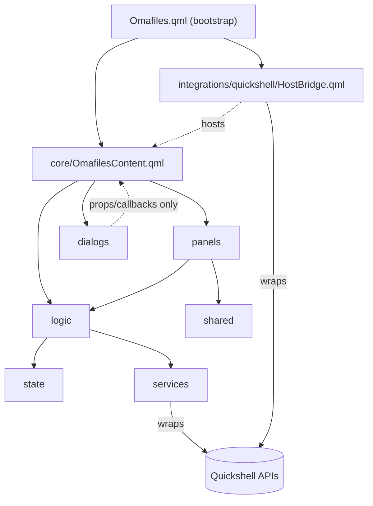

# Architecture

Omafiles started as a single-file Quickshell plugin (~6900 lines) and has
been progressively decoupled into a **host-independent core** plus a
**thin Quickshell integration layer**. This document describes that
result as of the `core-v1-ready` milestone — the point from which a
second frontend (Qt6 standalone) can be built without restructuring
anything below it.

## Folder structure

```
Omafiles.qml                    Quickshell bootstrap (~90 lines)
core/
  OmafilesContent.qml            Full visual tree + wiring (composition root)
integrations/
  HostAdapter.qml                 Formal host contract + shared size persistence
  quickshell/
    HostBridge.qml                FloatingWindow + host `shell` object, isolated
  standalone/
    Main.qml                       ApplicationWindow host (Qt6, main.cpp loads it)
    qml_modules/qs/                qs.Commons + qs.Ui adapters (theme/design system)
logic/                           Business logic (Process-based I/O, state mutation)
state/                           pragma Singleton data holders
panels/                          Large always-visible UI (sidebar, file lists, preview)
dialogs/                         Modal/floating UI
shared/                          Small reusable visual pieces
services/                        Quickshell process/env/notify wrapped as an Omafiles-owned API
scripts/, *.sh                   Backing shell scripts (list-dir.sh, trash-info.sh, ...)
```

## Layers



- **`Omafiles.qml`** — the object the Quickshell host loader actually
  instantiates. Holds only what the plugin ABI requires on the root
  object (`shell`, `open()`, `close()`, `opened`) and creates
  `HostBridge` + `OmafilesContent`, wiring them together. No business
  logic.
- **`core/OmafilesContent.qml`** — the real composition root: every
  property, every controller instantiation (`NavigationController`,
  `DirLister`, `ActionEngine`, `TabOps`, ...), the full visual tree
  (Sidebar, active panel, background panels, every dialog). Knows
  nothing about Quickshell — `requestClose()` emits a `closeRequested()`
  signal instead of talking to a host object directly.
- **`integrations/quickshell/HostBridge.qml`** — the only file that
  imports `Quickshell`'s `FloatingWindow` and touches the host-injected
  `shell` object. Exposes `show()`/`hide()`/`close()` and a
  `closedExternally()` signal; that's the entire contract `Omafiles.qml`
  depends on.
- **`state/`** — `pragma Singleton` data holders, no logic beyond
  property declarations. Imports nothing but `QtQuick` (`state/TabsState.qml`
  is the one exception, importing `services/` for `Env.get("HOME")` at
  init).
- **`logic/`** — business logic (`property Item root: null` pattern,
  or `hostRoot`/`hostX` for `Repeater`/`ListView` delegates — see
  dependency rule 6). Reads/writes `state/` by singleton name, talks to
  the OS exclusively through `services/`.
- **`panels/`** — large always-visible UI. Calls into `logic/`, reads
  `state/`.
- **`dialogs/`** — modal/floating UI. Purely presentational (local
  `id: root`); receives data via property bindings/callbacks only.
- **`shared/`** — small reusable visual pieces, no awareness of
  `state/`/`logic/` at all.
- **`services/`** — the only place `Quickshell.Io.Process`,
  `Quickshell.execDetached`, and `Quickshell.env` are called directly.
  Exposes an Omafiles-owned API instead (`ProcessRunner`, `ProcessWatcher`,
  `Detached`, `Notifier`, `Env`) so callers never see Quickshell's own
  types or naming.

## Dependency rules

1. `logic/` never imports `panels/`, `dialogs/`, `shared/`, `core/`, or
   `integrations/`.
2. `dialogs/` and `shared/` never import `state/` or `logic/` directly.
3. `state/` imports nothing but `QtQuick` (and `services/` where noted
   above) — no dependency on `logic/`/`panels/`/`core/`.
4. `core/ControllerRegistry.qml` is the single owner of every `logic/`
   controller — the only file that instantiates them (Phase 11.C; it
   replaced `OmafilesContent` in this role to kill the star coupling flagged
   by the 2026-08-09 audit). `OmafilesContent` instantiates the registry and
   the focused frontend components (`MainLayout`, `DialogLayer`,
   `CommandFacade`, `AppBindings`), passing each only the controllers it
   uses. One exception stands: `panels/ActiveFileList.qml` instantiates
   `logic/KeyboardShortcuts.qml`, since every dependency it needs is already
   a property on that panel.
5. No circular dependencies within `logic/` — see `DEPENDENCY_GRAPH.md`.
6. `logic/` and `panels/` never import `Quickshell` or anything under
   `integrations/`. Only `services/` and `integrations/quickshell/` do.
7. Only `Omafiles.qml` imports `integrations/quickshell/`. Nothing under
   `core/`, `logic/`, `state/`, `panels/`, `dialogs/`, `shared/`, or
   `services/` imports `integrations/` at all.

## Host contract (Phase 18)

The core talks to its host through exactly two things, and nothing more:
`OmafilesContent` exposes `open(payload)` / `close()` / `opened` and emits
`closeRequested()`. That is the whole surface a host consumes.

Going the other way, a host frontend must provide a **window/lifecycle**
implementation. This is the only genuinely host-specific capability and it
is formalized in `integrations/HostAdapter.qml`:

- **Window/lifecycle** (host-specific, one impl per frontend): `show()`,
  `hide()`, `close()`, and a `closedExternally()` signal (the window went
  away by a mechanism the host did not start — the WM close button).
  Implemented by `integrations/quickshell/HostBridge.qml` over
  `FloatingWindow` and by `integrations/standalone/Main.qml` over
  `ApplicationWindow`.
- **Geometry** (host-agnostic, shared): `HostAdapter` persists window
  **size** to `~/.local/state/omafiles/window.json` and restores it via a
  `sizeRestored(w, h)` signal each host applies to its own size property.
  Position/centering are deliberately out of scope — under Wayland the
  compositor owns window placement, so `center()` is a documented no-op.

Every other capability sometimes thought of as "host" is **not** routed
through the host; each is already abstracted layer-by-layer with one
identical API across both frontends:

| Capability      | Where it lives                                  |
| --------------- | ----------------------------------------------- |
| Theme           | `qs.Commons` (FileView on Quickshell, `ThemeSource` on Qt6) |
| Notifications   | `services/Notifier`                              |
| Open external   | `services/Detached`                              |
| Environment     | `services/Env`                                   |
| Process I/O     | `services/ProcessRunner` / `ProcessWatcher` (C++ backend) |
| JSON / files    | `services/JsonStore`, `DirectoryModel`, ...      |

So "the host" is a thin window/lifecycle adapter, not a god-object the core
depends on.

## Host-independent vs. Quickshell-specific

**Independent of the host** (everything a future `integrations/standalone/`
would reuse untouched): `core/`, `logic/`, `state/`, `panels/`, `dialogs/`,
`shared/`, `services/`, and the backing `.sh` scripts. None of these
import `Quickshell` or reference a `FloatingWindow`/host `shell` object.

**Per-frontend host code** (everything under `integrations/`, and nothing
else): the Quickshell side is `Omafiles.qml` (the plugin bootstrap that the
host loader instantiates) + `integrations/quickshell/HostBridge.qml`
(`FloatingWindow` + the host `shell` object). The Qt6 side is
`main.cpp` (bootstrap) + `integrations/standalone/Main.qml`
(`ApplicationWindow`, no host `shell` object) + the `qs.Commons`/`qs.Ui`
adapters under `integrations/standalone/qml_modules/`. Both hosts consume
the same core surface and implement the same `HostAdapter` contract. As of
Phase 18 the Qt6 standalone is a full production frontend, not a
demonstration: `services/*.qml` already have a single host-agnostic
implementation (they wrap the C++ backend, no longer `Quickshell.Io`), so a
frontend swap touches only `integrations/`, never a caller below it.

## Why this is a reusable core

`core/OmafilesContent.qml` has zero references to `FloatingWindow`,
`HostBridge`, or the host's `shell` object, and every dependency it pulls
in (`logic/`, `state/`, `panels/`, `dialogs/`, `shared/`, `services/`) is
equally Quickshell-free. It exposes exactly the surface a host needs:
`open(payload)`, `close()`, `opened`, and a `closeRequested()` signal.
Any QML host that can instantiate an `Item` and connect those four things
can run it. Two do today: `integrations/quickshell/HostBridge.qml` backed
by `FloatingWindow`, and `integrations/standalone/Main.qml` backed by
`ApplicationWindow` — both implementing the same `HostAdapter` contract.
