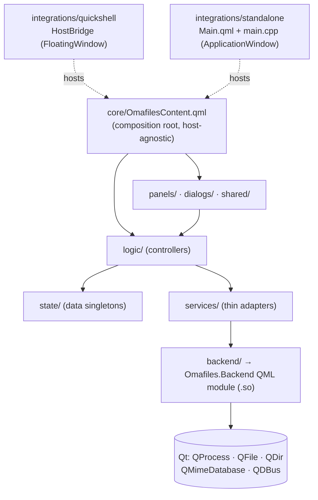

# C++ backend design (Phase 5+)

A **design** document, not an implementation one. It defines Omafiles' target
C++ architecture and the optimal migration order. It complements
`ARCHITECTURE.md`, which describes the already-existing QML separation
(`core/`, `logic/`, `state/`, `panels/`, `dialogs/`, `shared/`,
`services/`, `integrations/`) and is still valid as is.

> **Status (RC1).** Most of the plan below is **done**: steps 5.A–5.C, 6.A and
> 6.B are complete, `services/` are already thin single-implementation adapters
> over the C++ backend, and the Phase 16 work (SearchWorker, NetworkMounts,
> native Trash) landed too. `DirModel` (8.A) was resolved in Phase 15 as a pure
> data provider (see §5.3). The success criteria of §9 are met. The narrative is
> kept for historical context; the per-section "RESOLVED"/"done" markers reflect
> the current state.

---

## 1. Real starting point

What is already done and verified (not redesigned, relocated):

| Type | Backing | Status |
|------|---------|--------|
| `ProcessRunner` | `QProcess` | ✅ works in standalone |
| `ProcessWatcher` | `QProcess` monitor mode | ✅ works in standalone |
| `Env` | `qEnvironmentVariable` | ✅ works in standalone |

The six `backend/` files **do not change** in this design. What
changes is *how they are packaged and loaded*: today they are compiled inside the
standalone executable, and that is precisely what prevents sharing them
with Quickshell.

The Phase 5 success criterion — *both frontends use exactly the same C++
backend* — has since been **met** (step 5.B, §4). The `backend/` module is now a
shared `.so` loaded by import path; the standalone loads it the same way
Quickshell did before the Quickshell frontend was removed (Beta 1).

---

## 2. Design principles

1. **QML describes the interface; C++ talks to the operating system.** No
   presentation logic in C++, no `QProcess`/`stat`/JSON by hand in
   QML.
2. **The QML API doesn't change.** A C++ type that replaces a QML one exposes
   the same properties, methods and signals, with the same names. The
   bar: `logic/` must not change a single line when migrating a service.
   The three already migrated fulfill this.
3. **`services/` are one-line adapters.** Their only reason to exist
   after the migration is to give the name `Omafiles.Services.X` and isolate
   `logic/` from the backend module's name.
4. **The backend doesn't know Quickshell.** Zero `#include` of Quickshell,
   zero link dependency. Only public Qt. It's what lets the
   same `.so` serve both frontends and survive
   `quickshell-git` being updated.
5. **Async by default.** No call from QML may block the
   UI thread. Permitted exceptions: cheap, purely in-
   memory queries (`Env.get`, mime by extension).
6. **The current architecture rules also apply to C++**: one
   class per `.h`/`.cpp` pair, 300-500 line limit, small changes
   one at a time.

### New dependency rule (extends `ARCHITECTURE.md`)

> **8.** Only `services/` imports `Omafiles.Backend`. Neither `core/`, nor
> `logic/`, nor `state/`, nor `panels/`, nor `dialogs/`, nor `shared/`.
> `integrations/` may do so in its bootstrap (it needs the backend before
> the QML tree exists), but it's preferable that it too go through
> `services/`.

This keeps the current separation intact: the graph is still
`logic/ → services/ → backend/`, acyclic, and `logic/` still doesn't know whether
underneath there is Quickshell, QProcess or a test mock.

---

## 3. Target architecture



The key difference from today: **`Omafiles.Backend` is a shared
artifact**, not code inside the standalone executable. The two
frontends load it by the same mechanism (import path), from the same
file on disk.

Elegant corollary: when the five services are migrated,
**`services/+standalone/` disappears entirely**. The `QQmlFileSelector`
stops being needed for services — there are no longer two implementations to
select, there is only one. The selector would only still make sense if
some day a per-host UI variant were needed.

---

## 4. The central problem: how Quickshell loads a C++ type

This is the one genuinely risky point of the design, and that's why it's the
first thing to resolve.

**The obstacle.** The standalone is our own binary: adding C++ to it is
trivial (already done). Quickshell is a binary preinstalled by pacman
that only loads QML — it can't compile our `.cpp`. The only way is to
give it a **QML module with a C++ plugin** (`.so` + `qmldir` + `.qmltypes`)
in a path its `QQmlEngine` looks at.

**What is verified:** Quickshell 0.3.0 and our toolchain build against the
same Qt 6.11.1 from the repos, so the `.so` is compatible at the ABI level.

**What is NOT verified (and must be checked before anything else):** that
Quickshell respects `QML_IMPORT_PATH`, and that this variable reaches the
process as Omarchy launches it (uwsm/systemd). On this machine there was
already a precedent of environment variables not reaching where they were
expected (`~/.config/hypr/envs.conf` wasn't sourced, in the Qt theme matter).

### Packaging strategy

`backend/` becomes a **shared library with a QML module**:

```cmake
# sketch, not final
qt_add_library(omafiles-backend SHARED)
qt_add_qml_module(omafiles-backend
  URI Omafiles.Backend
  VERSION 1.0
  PLUGIN_TARGET omafiles-backendplugin
  OUTPUT_DIRECTORY ${CMAKE_BINARY_DIR}/qml/Omafiles/Backend
  SOURCES ...
)
```

Produces `build/qml/Omafiles/Backend/{qmldir, libomafiles-backendplugin.so, ...}`.

**Design decision:** the standalone **also** must load it by import
path, instead of linking it inside the executable. It costs one line
(`engine.addImportPath()`) and in exchange the two frontends use literally
the same file loaded the same way — which is exactly what
the success criterion asks for, and eliminates the class of "works in standalone
but not in Quickshell" bugs derived from different load paths.

### Where to install it

| Option | Advantage | Drawback |
|--------|-----------|----------|
| **(a) System** `/usr/lib/qt6/qml/` | Quickshell sees it without configuring anything | Requires root, puts foreign files in a pacman directory |
| **(b) User** `~/.local/lib/qt6/qml/` | No root, standard XDG path | Depends on exporting `QML_IMPORT_PATH` in the session |
| **(c) In the tree** `<plugin>/build/qml/` | Zero installation, ideal in development | Also depends on `QML_IMPORT_PATH` |

**Recommendation: (c) to validate and develop, (b) as the stable
state.** Discard (a): it dirties a pacman-managed directory on
a machine where system cleanup is reviewed carefully, and it doesn't
add anything (b) doesn't give.

If `QML_IMPORT_PATH` turned out not to reach Quickshell, plan B is a
launch wrapper that exports it before starting the shell; and plan C,
keeping the two implementations (Quickshell stays with its QML
over `Quickshell.Io.Process`) and accepting that the "same
backend" criterion is met only in standalone. It's worth knowing this *before*
migrating ten more types.

### Detail: cleanup on reload

Quickshell reloads the QML live. A `.so` is not reloaded, but the
objects are destroyed and recreated. Every backend type that has a live
child process (`ProcessWatcher` with its `inotifywait`) **must kill it
in the destructor**, or each reload will leave an orphan `inotifywait`
accumulating. It's a requirement, not a detail.

### Resolved (5.B / 5.B.1) — how each frontend loads, validated

The 5.B spike answered yes to the open question above. Final
mechanism, checked empirically on this machine:

- **Packaging:** `backend/` → shared library with a QML module
  (`qt_add_qml_module` + `PLUGIN_TARGET`), produces a single
  `libomafiles-backend.so` + `qmldir` + `.qmltypes`.
- **Stable installation:** `cmake --install build` copies the module to
  `~/.local/lib/qt6/qml/Omafiles/Backend/` (option **b**, not the ephemeral
  `build/` — option c discarded as the stable state).
- **Standalone:** loads it by import path (`addImportPath`), does NOT link it
  → same `.so`, same load mechanism as Quickshell.
- **Quickshell:** loads it via `QML_IMPORT_PATH`, made persistent in
  `~/.config/environment.d/omafiles-backend.conf` (template in
  `scripts/omafiles-backend.conf`). Verified that `environment.d` reaches
  the real `quickshell` process under uwsm/systemd. The "not verified
  under uwsm" risk of §8 is **closed**.

The only step that requires a login/session restart is for the live
session to pick up the new variable; the mechanism itself is proven.

---

## 5. Catalog of backend types

A single URI, `Omafiles.Backend`. Grouped by concern; it's split into several
URIs only if it grows past ~15 types.

### 5.1 Process and environment — *the layer that replaces `services/`*

| Type | QML form | Qt backing | Status |
|------|----------|-----------|--------|
| `ProcessRunner` | element | `QProcess` | ✅ done |
| `ProcessWatcher` | element | `QProcess` monitor | ✅ done |
| `Env` | singleton | `qEnvironmentVariable` | ✅ done |
| `Detached` | singleton | `QProcess::startDetached` | ✅ done (5.C) |
| `Notifier` | singleton | `notify-send` → later QDBus | ✅ done (5.C) |

`Notifier` deserves a note: today it launches `notify-send` as a process. Moving it
to **`org.freedesktop.Notifications` via QDBus** eliminates a fork per
notification and gives notification IDs, which would allow replacing or
closing an in-progress notification (useful for copy progress). It's not
urgent; it is the idiomatic form.

### 5.2 Persistence — *the cheapest remaining win*

Today `logic/Persistence.qml` reads its JSON by launching **`cat` as a process**
(bookmarks, recents, bulk-rename history, session) and writes them via
shell. The startup traces confirm it: 3-4 forks just to read
four small files.

| Type | Form | Backing |
|------|------|---------|
| `JsonStore` | singleton | `QFile` + `QJsonDocument` |

```
read(path) → signal loaded(path, var data, bool ok)   // async, no fork
write(path, data) → signal saved(path, bool ok)       // atomic write
```

Advantages: no forks, C++ parsing, and **atomic write** (temp
file + `rename`), which today is not guaranteed — a cut halfway through
`saveSession()` can leave `session.json` truncated. It's self-contained,
doesn't touch UI, and can be migrated without any panel noticing.

### 5.3 Filesystem and models — *the bulk of the heavy work*

| Type | Form | Backing | Replaces |
|------|------|---------|----------|
| `DirModel` | `QAbstractListModel` | `QDirIterator` + `QFileInfo` | `list-dir.sh` + `Utils.parseEntries` |
| `DirSortProxy` | `QSortFilterProxyModel` | — | sorting/filtering/hidden in JS |
| `MimeDb` | singleton | `QMimeDatabase` | part of `FileTypeUtils` |
| `DirWatcher` | element | `QFileSystemWatcher` | `inotifywait` via `ProcessWatcher` |
| `ThumbnailProvider` | `QQuickImageProvider` | worker + cache | `thumbnail-video.sh` + temp files |
| `FileOps` | element | worker thread | `cp`/`mv`/`rm` via `ActionEngine` |

#### `DirModel` in detail

It's the highest-value and highest-risk change. `list-dir.sh` is a good
script, but **almost all its complexity exists because the data has to
cross a shell pipe**:

- the NUL protocol exists because a name can carry tabs or line
  breaks → in C++ the names are `QString`, the problem doesn't exist;
- the batch `stat` exists because a fork per file took >5 s in
  `/usr/bin` (4197 entries) → in C++ there are no forks, `QFileInfo` does the
  syscall directly;
- the `sort -fz` with auxiliary arrays exists for the same reason → in C++ it's a
  `std::sort` over a vector.

What **does have to be preserved explicitly** when porting it, because it's
earned knowledge and doesn't follow from the C++ code:

- symlink state `broken`/`valid`/empty (`isSymLink()` + `exists()` of the
  target; `QFileInfo` follows the link by default and a broken one would look like
  a 0-byte file from 1970, which is exactly the bug the script fixed);
- folders first, then files, each group alphabetical **case-
  insensitively** (`sort -f`);
- the distinct exit codes (doesn't exist / not a directory / no
  read or execute permission) to be able to warn for real instead of
  showing "0 items" — in the model they become an enumerated `error`
  property.

Model roles, with the current names to minimize the change in the
delegates: `type`, `name`, `size`, `mtime`, `link`.

**The real risk isn't C++, it's the UI.** Today `panels/` receives an *array* of
objects and does `.filter`/`.map`/`.slice` over it in several places
(selection, sorting, incremental search). A `QAbstractListModel` doesn't
support that. So `DirModel` **isn't migrated all at once**: first it's
introduced as a data source with the array API intact, and only after
that are the consumers converted one by one. Hence it's placed late
in the plan.

> **RESOLVED — Phase 15 (Option B), 2026-08-10.** The "only after the
> consumers are converted" (step 8.A, adopting the roles in the UI) is
> **definitively cancelled**, not deferred anymore. Measured (100/1k/10k/50k): the
> scan dominates (~80 % of the listing at 50k, 680 ms); the only cost a
> model-with-roles would have avoided —building the `QVariantList`— is <20 % and
> only appears in unusual folders >10k. And there's an architectural impediment
> above the metric: `NavState.entries` (the real `ListView.model`) is
> fed from FOUR heterogeneous sources —normal listing, recursive search
> (`SearchWorker`), archive content, trash— that produce arrays; a
> `QAbstractListModel` cannot represent the last three. So the array
> **is** the canonical representation, and `DirModel` degrades to a pure data
> provider: the dead roles are removed, `roleNames()`/`data()`/
> `rowCount()` and the `QAbstractListModel` base. Single source of truth for the
> entries: `NavState.entries`. See the AUDIT-V2 revalidation table.

#### `DirWatcher` — not a direct replacement

`QFileSystemWatcher` is not equivalent to `inotifywait -m` with the current
event list (`attrib`, `close_write`, `moved_from`...). It gives less
granularity and has descriptor limits. The design is to have it as a
**native alternative with fallback to `ProcessWatcher`**, not as a blind
replacement. Low value, non-trivial risk: it goes last.

### 5.4 Search

`SearchWorker` (cancelable worker thread) would replace
`search-recursive.sh`. Its advantage over the script isn't speed but
**clean cancellation and incremental results**. Optional.

---

## 6. Threading model

- The UI thread **never** does disk I/O that can take time.
- Listing, search and thumbnails go in a `QThreadPool`/worker; the result
  is delivered by a queued signal to the UI thread.
- Cancellation pattern: **generation counter**, not killing threads. It's
  exactly the idiom the project already uses in QML
  (`previewRequestId` / `_previewTextOwner` in `PreviewLoader`): a
  result that arrives with an old generation is discarded. Keeping it
  makes the C++ code familiar and avoids inventing a new mechanism.
- Every backend object with an associated process or thread cleans up in the destructor
  (see §4, Quickshell reload).

---

## 7. Incremental plan

Order governed by one idea: **validate the deployment before the
volume**. Migrating ten more types before knowing whether Quickshell can load
a `.so` would be potentially wasted work.

Each step ends the same: compile → start Quickshell → start
standalone → verify both → commit.

### Step 5.A — Base services in C++ ✅ *done*
`ProcessRunner`, `ProcessWatcher`, `Env` over real Qt, standalone only.
Verified empirically (real listing, real inotify events, real
variables).

### Step 5.B — Package and share · **closes Phase 5** ✅ *done*
Turn `backend/` into a shared library with a QML module; standalone
switches to loading it by import path; validate that Quickshell loads it; switch
`services/ProcessRunner|ProcessWatcher|Env.qml` to the C++ backend.

Before touching anything, a **20-minute spike**: a toy C++ type,
`QML_IMPORT_PATH` pointing to the build, and check whether Quickshell
imports it. That experiment decides whether the Phase 5 success criterion is
achievable as written.

*Success:* both frontends run over the same `.so`.

### Step 5.C — `Detached` + `Notifier` ✅ *done*
Trivial once 5.B works. Their value is architectural: on migrating them,
**`services/+standalone/` is deleted entirely** and the need for the
file selector for services disappears.

*Success:* `services/` are five one-line adapters and not a single
stub remains.

> **Note on Phase 6 of the roadmap.** Phase 6 was defined as
> "replace the standalone stubs with real implementations". When
> 5.C finishes **no stubs remain**: the stubs *were* the services. Phase
> 6 is absorbed almost entirely here, and what remains (the
> `qs.Ui`/`qs.Commons` adapters, theme, typography) is actually
> parity work, i.e. Phase 7. It's worth recognizing this instead of dragging
> a half-empty phase along.

### Step 6.A — `JsonStore` ✅ *done*
Self-contained, no UI impact, eliminates startup forks and fixes the
non-atomic session write. Best value/risk ratio of what
remained.

### Step 6.B — `MimeDb`
Type detection with `QMimeDatabase` instead of extension-based
heuristics. Self-contained.

### Step 8.A — `DirModel` (+ sort/filter proxy) ✅ *done (Phase 15)*
The big change. Landed as a pure data source keeping the array API; the
"convert consumers one by one" second stage was cancelled — the array is the
canonical representation (see the RESOLVED note in §5.3).

### Step 8.B — `ThumbnailProvider`, `FileOps` with real progress, native `DirWatcher`, `SearchWorker` ✅ *done*
All landed: on-disk cached thumbnails, native `FileOperations` with byte-exact
progress and cancellation, native `QFileSystemWatcher` with `ProcessWatcher`
fallback, and the cancelable `SearchWorker`. None was necessary for
frontend parity; they landed anyway.

### Summary

| Step | What | Phase | Risk | Status |
|------|------|-------|------|-------|
| 5.A | 3 base services | 5 | — | ✅ done |
| **5.B** | **package + Quickshell** | **5** | **high** | ✅ done (unblocked everything) |
| 5.C | Detached + Notifier | 5/6 | low | ✅ done (deleted `+standalone/`) |
| 6.A | JsonStore | 6 | low | ✅ done |
| 6.B | MimeDb | 6 | low | not done (type detection still extension-based) |
| 8.A | DirModel | 8 | high | ✅ done (Phase 15, as a data provider — see §5.3) |
| 8.B | thumbs / fileops / watcher / search | 8 | variable | ✅ done (ThumbnailProvider, native FileOps w/ progress, native DirWatcher, SearchWorker) |

---

## 8. Risks

| Risk | Impact | Mitigation |
|------|--------|------------|
| Quickshell doesn't see the module | Blocks the Phase 5 criterion | 5.B spike **before** migrating more types; plans B (wrapper) and C (dual implementation) |
| `QML_IMPORT_PATH` doesn't arrive under uwsm | Same as the previous one | Known precedent on this machine with `envs.conf`; check in the real process, not in a terminal |
| A Qt update breaks the `.so` | Quickshell doesn't start the plugin | The backend only uses Qt's public API; recompile after minor version bumps. Document the rebuild command |
| `DirModel` breaks the UI | Visible regression in the manager | Introduce as a data source with the array API; convert consumers one by one |
| Orphan processes on reload | `inotifywait` accumulating | Mandatory cleanup in destructors |

---

## 9. Phase 5 success criterion (revised)

The phase can be considered closed when:

- [x] `ProcessRunner` uses real `QProcess`
- [x] `ProcessWatcher` uses real Qt
- [x] `Env` reads real variables
- [x] **both frontends load the same backend module** (validated in 5.B before the Quickshell frontend was removed; the standalone loads the shared `.so` by import path)
- [x] `services/` are thin adapters (all five migrated)

All three original items are done and verified. The fourth was step 5.B
and is the one that really closes the phase — done.

---

## 10. System adapters (intentionally NOT migrated)

After Phase 16, almost the whole platform is native C++ backend. Two shell
scripts remain that are NOT "legacy shell to clean up" but **thin, stable
shims over standard Linux tools** — the *correct* way to
query that information on the system. They have no clean equivalent in pure
Qt (they'd require linking `libblkid`/`libudev` or reimplementing the XDG
resolution of applications), and reimplementing them by hand would regress real
functionality. They are catalogued here explicitly so future audits don't confuse
them with residue:

| Script | Stable interface with | Why it stays |
|---|---|---|
| `list-mounts.sh` | `lsblk` / `findmnt` (util-linux) | Enumerates mounts **and removable devices that are NOT mounted** with their `fstype`/`label`/`removable`, to offer "Mount" from the UI. `QStorageInfo` only sees what's ALREADY mounted; the `lsblk` part needs `libblkid`/`libudev`. |
| `open-with-list.sh` | GIO (`gio mime`) + `xdg-mime` | Resolves the applications associated to a MIME type according to the system's XDG rules (`mimeapps.list`, `mimeinfo.cache`, defaults, subtypes). Qt (`QMimeDatabase`) detects the type but does NOT expose the app resolution. |

Both run via `ProcessRunner` and their output is parsed in QML
(`Utils.parseMounts` for the first; the second is read directly in
`logic/OpenWithOps.qml`). Stable data contract: if some day a reasonable
native API appears (or it's decided to assume `libblkid`), the migration is local to
those two consumers.

### Migrated to native in Phase 16

| Retired script | Native replacement |
|---|---|
| `search-recursive.sh` | `backend/SearchWorker` (QDirIterator + QThreadPool, cancelable) |
| `list-network-mounts.sh` | `backend/NetworkMounts` (reads `$XDG_RUNTIME_DIR/gvfs`) |
| `trash-roots.sh` | `FileOperations::trashRoots()` (QStorageInfo + XDG Trash) |
| `trash-info.sh` | `FileOperations::trashInfo()` (`.trashinfo` parsing, reuses `restoreByOrigPath`) |
