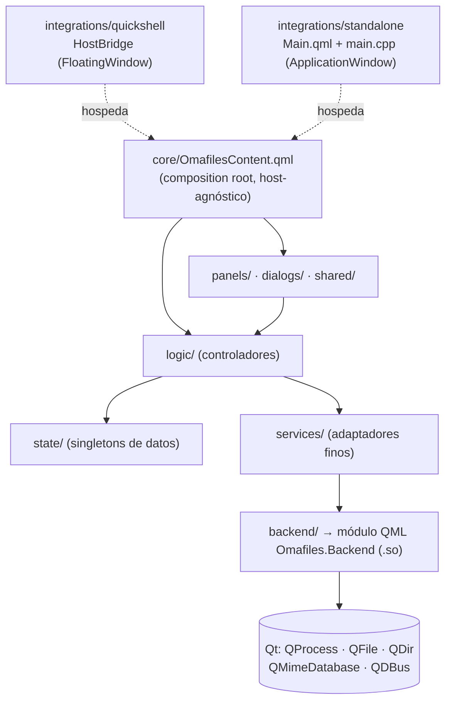

# Diseño del backend C++ (Fase 5+)

Documento de **diseño**, no de implementación. Define la arquitectura C++
objetivo de Omafiles y el orden óptimo de migración. Complementa
`ARCHITECTURE.md`, que describe la separación QML ya existente
(`core/`, `logic/`, `state/`, `panels/`, `dialogs/`, `shared/`,
`services/`, `integrations/`) y sigue siendo válido tal cual.

---

## 1. Punto de partida real

Lo que ya está hecho y verificado (no se rediseña, se reubica):

| Tipo | Respaldo | Estado |
|------|----------|--------|
| `ProcessRunner` | `QProcess` | ✅ funciona en standalone |
| `ProcessWatcher` | `QProcess` modo monitor | ✅ funciona en standalone |
| `Env` | `qEnvironmentVariable` | ✅ funciona en standalone |

Los seis ficheros de `backend/` **no cambian** en este diseño. Lo que
cambia es *cómo se empaquetan y se cargan*: hoy van compilados dentro del
ejecutable standalone, y eso es precisamente lo que impide compartirlos
con Quickshell.

Sigue pendiente el criterio de éxito de la Fase 5: *ambos frontends usan
exactamente el mismo backend C++*.

---

## 2. Principios de diseño

1. **QML describe interfaz; C++ habla con el sistema operativo.** Nada de
   lógica de presentación en C++, nada de `QProcess`/`stat`/JSON a mano en
   QML.
2. **La API QML no cambia.** Un tipo C++ que sustituye a uno QML expone
   las mismas propiedades, métodos y señales, con los mismos nombres. El
   listón: `logic/` no debe cambiar ni una línea al migrar un servicio.
   Los tres ya migrados cumplen esto.
3. **`services/` son adaptadores de una línea.** Su única razón de existir
   tras la migración es dar el nombre `Omafiles.Services.X` y aislar a
   `logic/` del nombre del módulo backend.
4. **El backend no conoce a Quickshell.** Cero `#include` de Quickshell,
   cero dependencia de enlace. Solo Qt público. Es lo que permite que el
   mismo `.so` sirva a los dos frontends y sobreviva a que
   `quickshell-git` se actualice.
5. **Asíncrono por defecto.** Ninguna llamada desde QML puede bloquear el
   hilo de UI. Excepciones permitidas: consultas baratas y puramente en
   memoria (`Env.get`, mime por extensión).
6. **Las reglas de arquitectura vigentes se aplican también a C++**: una
   clase por par `.h`/`.cpp`, límite de 300-500 líneas, cambios pequeños
   de uno en uno.

### Regla de dependencia nueva (extiende `ARCHITECTURE.md`)

> **8.** Solo `services/` importa `Omafiles.Backend`. Ni `core/`, ni
> `logic/`, ni `state/`, ni `panels/`, ni `dialogs/`, ni `shared/`.
> `integrations/` puede hacerlo en su bootstrap (necesita el backend antes
> de que exista el árbol QML), pero es preferible que también pase por
> `services/`.

Esto mantiene intacta la separación actual: el grafo sigue siendo
`logic/ → services/ → backend/`, acíclico, y `logic/` sigue sin saber si
por debajo hay Quickshell, QProcess o un mock de test.

---

## 3. Arquitectura objetivo



La diferencia clave frente a hoy: **`Omafiles.Backend` es un artefacto
compartido**, no código dentro del ejecutable standalone. Los dos
frontends lo cargan por el mismo mecanismo (import path), del mismo
fichero en disco.

Corolario elegante: cuando los cinco servicios estén migrados,
**`services/+standalone/` desaparece entero**. El `QQmlFileSelector` deja
de hacer falta para servicios — ya no hay dos implementaciones que
seleccionar, hay una sola. El selector solo seguiría teniendo sentido si
algún día hiciera falta una variante de UI por host.

---

## 4. El problema central: cómo carga Quickshell un tipo C++

Este es el único punto de verdad arriesgado del diseño, y por eso es lo
primero que hay que resolver.

**El obstáculo.** El standalone es un binario nuestro: meterle C++ es
trivial (ya está hecho). Quickshell es un binario preinstalado por pacman
que solo carga QML — no puede compilar nuestro `.cpp`. La única vía es
darle un **módulo QML con plugin C++** (`.so` + `qmldir` + `.qmltypes`)
en una ruta que su `QQmlEngine` mire.

**Lo verificado:** Quickshell 0.3.0 y nuestro toolchain van contra el
mismo Qt 6.11.1 de los repos, así que el `.so` es compatible a nivel ABI.

**Lo NO verificado (y que hay que comprobar antes de nada):** que
Quickshell respete `QML_IMPORT_PATH`, y que esa variable llegue al
proceso tal y como Omarchy lo lanza (uwsm/systemd). En esta máquina ya
hubo un precedente de variables de entorno que no llegaban donde se
esperaba (`~/.config/hypr/envs.conf` no se sourceaba, en el tema de Qt).

### Estrategia de empaquetado

`backend/` pasa a ser una **biblioteca compartida con módulo QML**:

```cmake
# sketch, no definitivo
qt_add_library(omafiles-backend SHARED)
qt_add_qml_module(omafiles-backend
  URI Omafiles.Backend
  VERSION 1.0
  PLUGIN_TARGET omafiles-backendplugin
  OUTPUT_DIRECTORY ${CMAKE_BINARY_DIR}/qml/Omafiles/Backend
  SOURCES ...
)
```

Produce `build/qml/Omafiles/Backend/{qmldir, libomafiles-backendplugin.so, ...}`.

**Decisión de diseño:** el standalone **también** debe cargarlo por import
path, en vez de enlazarlo dentro del ejecutable. Cuesta una línea
(`engine.addImportPath()`) y a cambio los dos frontends usan literalmente
el mismo fichero cargado del mismo modo — que es exactamente lo que pide
el criterio de éxito, y elimina la clase de bugs "en standalone va y en
Quickshell no" derivados de rutas de carga distintas.

### Dónde instalarlo

| Opción | Ventaja | Inconveniente |
|--------|---------|---------------|
| **(a) Sistema** `/usr/lib/qt6/qml/` | Quickshell lo ve sin configurar nada | Requiere root, mete ficheros ajenos en un directorio de pacman |
| **(b) Usuario** `~/.local/lib/qt6/qml/` | Sin root, ruta estándar XDG | Depende de exportar `QML_IMPORT_PATH` en la sesión |
| **(c) En el árbol** `<plugin>/build/qml/` | Cero instalación, ideal en desarrollo | Igualmente depende de `QML_IMPORT_PATH` |

**Recomendación: (c) para validar y desarrollar, (b) como estado
estable.** Descartar (a): ensucia un directorio gestionado por pacman en
una máquina donde la limpieza del sistema se revisa a conciencia, y no
aporta nada que (b) no dé.

Si `QML_IMPORT_PATH` resultara no llegar a Quickshell, el plan B es un
wrapper de lanzamiento que la exporte antes de arrancar el shell; y el
plan C, mantener las dos implementaciones (Quickshell sigue con su QML
sobre `Quickshell.Io.Process`) y aceptar que el criterio de "mismo
backend" se cumple solo en standalone. Conviene saber esto *antes* de
migrar diez tipos más.

### Detalle: limpieza en recarga

Quickshell recarga el QML en caliente. Un `.so` no se recarga, pero los
objetos sí se destruyen y se recrean. Todo tipo backend que tenga un
proceso hijo vivo (`ProcessWatcher` con su `inotifywait`) **debe matarlo
en el destructor**, o cada recarga dejará un `inotifywait` huérfano
acumulándose. Es un requisito, no un detalle.

### Resuelto (5.B / 5.B.1) — cómo carga cada frontend, validado

El spike 5.B respondió que sí a la pregunta abierta de arriba. Mecanismo
final, comprobado empíricamente en esta máquina:

- **Empaquetado:** `backend/` → biblioteca compartida con módulo QML
  (`qt_add_qml_module` + `PLUGIN_TARGET`), produce un único
  `libomafiles-backend.so` + `qmldir` + `.qmltypes`.
- **Instalación estable:** `cmake --install build` copia el módulo a
  `~/.local/lib/qt6/qml/Omafiles/Backend/` (opción **b**, no el `build/`
  efímero — opción c descartada como estado estable).
- **Standalone:** lo carga por import path (`addImportPath`), NO lo enlaza
  → mismo `.so`, mismo mecanismo de carga que Quickshell.
- **Quickshell:** lo carga vía `QML_IMPORT_PATH`, hecho persistente en
  `~/.config/environment.d/omafiles-backend.conf` (plantilla en
  `scripts/omafiles-backend.conf`). Verificado que `environment.d` llega
  al proceso `quickshell` real bajo uwsm/systemd. El riesgo "no verificado
  bajo uwsm" de §8 queda **cerrado**.

El único paso que requiere un login/reinicio de sesión es que la sesión
viva recoja la variable nueva; el mecanismo en sí está probado.

---

## 5. Catálogo de tipos backend

Un solo URI, `Omafiles.Backend`. Agrupado por concern; se parte en varios
URIs solo si pasa de ~15 tipos.

### 5.1 Proceso y entorno — *la capa que sustituye a `services/`*

| Tipo | Forma QML | Respaldo Qt | Estado |
|------|-----------|-------------|--------|
| `ProcessRunner` | elemento | `QProcess` | ✅ hecho |
| `ProcessWatcher` | elemento | `QProcess` monitor | ✅ hecho |
| `Env` | singleton | `qEnvironmentVariable` | ✅ hecho |
| `Detached` | singleton | `QProcess::startDetached` | pendiente, trivial |
| `Notifier` | singleton | `notify-send` → luego QDBus | pendiente, trivial |

`Notifier` merece una nota: hoy lanza `notify-send` como proceso. Pasarlo
a **`org.freedesktop.Notifications` por QDBus** elimina un fork por
notificación y da IDs de notificación, lo que permitiría reemplazar o
cerrar una notificación en curso (útil para progreso de copiado). No es
urgente; sí es la forma idiomática.

### 5.2 Persistencia — *la victoria más barata que queda*

Hoy `logic/Persistence.qml` lee sus JSON lanzando **`cat` como proceso**
(bookmarks, recientes, historial de bulk-rename, sesión) y los escribe por
shell. Las trazas de arranque lo confirman: 3-4 forks solo para leer
cuatro ficheros pequeños.

| Tipo | Forma | Respaldo |
|------|-------|----------|
| `JsonStore` | singleton | `QFile` + `QJsonDocument` |

```
read(path) → señal loaded(path, var data, bool ok)   // async, sin fork
write(path, data) → señal saved(path, bool ok)       // escritura atómica
```

Ventajas: sin forks, parseo en C++, y **escritura atómica** (fichero
temporal + `rename`), que hoy no está garantizada — un corte a mitad de
`saveSession()` puede dejar el `session.json` truncado. Es autocontenido,
no toca UI, y se puede migrar sin que ningún panel se entere.

### 5.3 Filesystem y modelos — *el grueso del trabajo pesado*

| Tipo | Forma | Respaldo | Sustituye a |
|------|-------|----------|-------------|
| `DirModel` | `QAbstractListModel` | `QDirIterator` + `QFileInfo` | `list-dir.sh` + `Utils.parseEntries` |
| `DirSortProxy` | `QSortFilterProxyModel` | — | ordenación/filtrado/ocultos en JS |
| `MimeDb` | singleton | `QMimeDatabase` | parte de `FileTypeUtils` |
| `DirWatcher` | elemento | `QFileSystemWatcher` | `inotifywait` vía `ProcessWatcher` |
| `ThumbnailProvider` | `QQuickImageProvider` | worker + cache | `thumbnail-video.sh` + ficheros temporales |
| `FileOps` | elemento | worker thread | `cp`/`mv`/`rm` vía `ActionEngine` |

#### `DirModel` en detalle

Es el cambio de mayor valor y mayor riesgo. `list-dir.sh` es un script
bueno, pero **casi toda su complejidad existe porque el dato tiene que
atravesar una tubería de shell**:

- el protocolo NUL existe porque un nombre puede llevar tabs o saltos de
  línea → en C++ los nombres son `QString`, el problema no existe;
- el `stat` en lote existe porque un fork por fichero tardaba >5 s en
  `/usr/bin` (4197 entradas) → en C++ no hay forks, `QFileInfo` hace la
  syscall directa;
- el `sort -fz` con arrays auxiliares existe por lo mismo → en C++ es un
  `std::sort` sobre un vector.

Lo que **sí hay que preservar explícitamente** al portarlo, porque es
conocimiento ganado y no se deduce del código C++:

- estado de symlink `broken`/`valid`/vacío (`isSymLink()` + `exists()` del
  destino; `QFileInfo` sigue el enlace por defecto y un roto se vería como
  fichero de 0 bytes de 1970, que es justo el bug que el script arregló);
- carpetas primero, luego ficheros, cada grupo alfabético **sin distinguir
  mayúsculas** (`sort -f`);
- los códigos de salida distintos (no existe / no es directorio / sin
  permiso de lectura o ejecución) para poder avisar de verdad en vez de
  enseñar "0 items" — en el modelo pasan a ser una propiedad `error`
  enumerada.

Roles del modelo, con los nombres actuales para minimizar el cambio en los
delegados: `type`, `name`, `size`, `mtime`, `link`.

**El riesgo real no es C++, es la UI.** Hoy `panels/` recibe un *array* de
objetos y hace `.filter`/`.map`/`.slice` sobre él en varios sitios
(selección, ordenación, búsqueda incremental). Un `QAbstractListModel` no
soporta eso. Por tanto `DirModel` **no se migra de golpe**: primero se
introduce como fuente de datos con la API de array intacta, y solo después
se convierten los consumidores uno a uno. De ahí que esté colocado tarde
en el plan.

> **RESUELTO — Fase 15 (Opción B), 2026-08-10.** El "solo después se
> convierten los consumidores" (escalón 8.A, adoptar los roles en la UI) se
> **cancela definitivamente**, no se aplaza más. Medido (100/1k/10k/50k): el
> scan domina (~80 % del listado a 50k, 680 ms); el único coste que un
> modelo-con-roles habría evitado —construir el `QVariantList`— es <20 % y
> solo aparece en carpetas raras >10k. Y hay un impedimento arquitectónico
> por encima de la métrica: `NavState.entries` (el `ListView.model` real) se
> alimenta de CUATRO fuentes heterogéneas —listado normal, búsqueda recursiva
> (`SearchWorker`), contenido de archivos, papelera— que producen arrays; un
> `QAbstractListModel` no puede representar las tres últimas. Así que el array
> **es** la representación canónica, y `DirModel` se degrada a proveedor de
> datos puro: se retiran los roles muertos, `roleNames()`/`data()`/
> `rowCount()` y la base `QAbstractListModel`. Fuente de verdad única para las
> entradas: `NavState.entries`. Ver la tabla de la revalidación del AUDIT-V2.

#### `DirWatcher` — no es un reemplazo directo

`QFileSystemWatcher` no es equivalente a `inotifywait -m` con la lista de
eventos actual (`attrib`, `close_write`, `moved_from`...). Da menos
granularidad y tiene límites de descriptores. El diseño es tenerlo como
**alternativa nativa con fallback a `ProcessWatcher`**, no como
sustitución ciega. Bajo valor, riesgo no trivial: va al final.

### 5.4 Búsqueda

`SearchWorker` (worker thread cancelable) sustituiría a
`search-recursive.sh`. Su ventaja frente al script no es velocidad sino
**cancelación limpia y resultados incrementales**. Opcional.

---

## 6. Modelo de hilos

- El hilo de UI **nunca** hace E/S de disco que pueda tardar.
- Listado, búsqueda y miniaturas van en `QThreadPool`/worker; el resultado
  se entrega por señal encolada al hilo de UI.
- Patrón de cancelación: **contador de generación**, no matar hilos. Es
  exactamente el idioma que el proyecto ya usa en QML
  (`previewRequestId` / `_previewTextOwner` en `PreviewLoader`): un
  resultado que llega con una generación vieja se descarta. Mantenerlo
  hace el código C++ familiar y evita inventar un mecanismo nuevo.
- Todo objeto backend con proceso o hilo asociado limpia en el destructor
  (ver §4, recarga de Quickshell).

---

## 7. Plan incremental

Orden gobernado por una idea: **validar el despliegue antes que el
volumen**. Migrar diez tipos más antes de saber si Quickshell puede cargar
un `.so` sería trabajo potencialmente tirado.

Cada escalón termina igual: compilar → arrancar Quickshell → arrancar
standalone → verificar los dos → commit.

### Escalón 5.A — Servicios base en C++ ✅ *hecho*
`ProcessRunner`, `ProcessWatcher`, `Env` sobre Qt real, solo standalone.
Verificado empíricamente (listado real, eventos inotify reales, variables
reales).

### Escalón 5.B — Empaquetar y compartir · **cierra la Fase 5**
Convertir `backend/` en biblioteca compartida con módulo QML; standalone
pasa a cargarlo por import path; validar que Quickshell lo carga; cambiar
`services/ProcessRunner|ProcessWatcher|Env.qml` al backend C++.

Antes de tocar nada, un **spike de 20 minutos**: un tipo C++ de juguete,
`QML_IMPORT_PATH` apuntando al build, y comprobar si Quickshell lo
importa. Ese experimento decide si el criterio de éxito de la Fase 5 es
alcanzable tal y como está escrito.

*Éxito:* los dos frontends corren sobre el mismo `.so`.

### Escalón 5.C — `Detached` + `Notifier`
Triviales una vez 5.B funciona. Su valor es arquitectónico: al migrarlos,
**`services/+standalone/` se borra entero** y desaparece la necesidad del
file selector para servicios.

*Éxito:* `services/` son cinco adaptadores de una línea y no queda ni un
stub.

> **Nota sobre la Fase 6 del roadmap.** La Fase 6 se definió como
> "reemplazar los stubs del standalone por implementaciones reales". Al
> terminar 5.C **no quedan stubs**: los stubs *eran* los servicios. La
> Fase 6 se absorbe casi entera aquí, y lo que quede (adaptadores
> `qs.Ui`/`qs.Commons`, tema, tipografía) es en realidad trabajo de
> paridad, o sea Fase 7. Merece la pena reconocerlo en vez de arrastrar
> una fase medio vacía.

### Escalón 6.A — `JsonStore`
Autocontenido, sin impacto en UI, elimina forks del arranque y arregla la
escritura no atómica de la sesión. Mejor relación valor/riesgo de lo que
queda.

### Escalón 6.B — `MimeDb`
Detección de tipos con `QMimeDatabase` en vez de heurísticas por
extensión. Autocontenido.

### Escalón 8.A — `DirModel` (+ proxy de orden/filtro)
El cambio grande. Solo cuando 5.B esté asentado y con tiempo por delante.
Se hace en dos tiempos: primero como fuente de datos manteniendo la API de
array, después convirtiendo consumidores uno a uno.

### Escalón 8.B — `ThumbnailProvider`, `FileOps` con progreso real, `DirWatcher` nativo, `SearchWorker`
Opcionales, por orden de valor decreciente y riesgo creciente. Ninguno es
necesario para la paridad entre frontends.

### Resumen

| Escalón | Qué | Fase | Riesgo | Valor |
|---------|-----|------|--------|-------|
| 5.A | 3 servicios base | 5 | — | ✅ hecho |
| **5.B** | **empaquetar + Quickshell** | **5** | **alto** | **desbloquea todo** |
| 5.C | Detached + Notifier | 5/6 | bajo | borra `+standalone/` |
| 6.A | JsonStore | 6 | bajo | alto |
| 6.B | MimeDb | 6 | bajo | medio |
| 8.A | DirModel | 8 | alto | alto |
| 8.B | thumbs / fileops / watcher / search | 8 | variable | medio |

---

## 8. Riesgos

| Riesgo | Impacto | Mitigación |
|--------|---------|------------|
| Quickshell no ve el módulo | Bloquea el criterio de la Fase 5 | Spike de 5.B **antes** de migrar más tipos; planes B (wrapper) y C (doble implementación) |
| `QML_IMPORT_PATH` no llega bajo uwsm | Igual que el anterior | Precedente conocido en esta máquina con `envs.conf`; comprobar en el proceso real, no en una terminal |
| Actualización de Qt rompe el `.so` | Quickshell no arranca el plugin | El backend solo usa API pública de Qt; recompilar tras subidas de versión menor. Documentar el comando de rebuild |
| `DirModel` rompe la UI | Regresión visible en el gestor | Introducir como fuente de datos con API de array; convertir consumidores de uno en uno |
| Procesos huérfanos al recargar | `inotifywait` acumulándose | Limpieza obligatoria en destructores |

---

## 9. Criterio de éxito de la Fase 5 (revisado)

La fase se puede dar por cerrada cuando:

- [x] `ProcessRunner` usa `QProcess` real
- [x] `ProcessWatcher` usa Qt real
- [x] `Env` lee variables reales
- [ ] **los dos frontends cargan el mismo módulo backend**
- [ ] `services/` son adaptadores finos (parcial: 3 de 5)

Los tres primeros están hechos y verificados. El cuarto es el escalón 5.B
y es el que de verdad cierra la fase.

---

## 10. System adapters (intencionadamente NO migrados)

Tras la Fase 16, casi toda la plataforma es backend C++ nativo. Quedan **dos**
scripts de shell que NO son "shell heredado a limpiar" sino **shims finos y
estables sobre herramientas estándar de Linux** — la forma *correcta* de
consultar esa información en el sistema. No tienen equivalente limpio en Qt
puro (requerirían enlazar `libblkid`/`libudev` o reimplementar la resolución
XDG de aplicaciones), y reimplementarlos a mano regresaría funcionalidad real.
Se catalogan aquí explícitamente para que futuras auditorías no los confundan
con residuo:

| Script | Interfaz estable con | Por qué se queda |
|---|---|---|
| `list-mounts.sh` | `lsblk` / `findmnt` (util-linux) | Enumera montajes **y dispositivos extraíbles SIN montar** con su `fstype`/`label`/`removable`, para ofrecer "Montar" desde la UI. `QStorageInfo` solo ve lo YA montado; la parte de `lsblk` necesita `libblkid`/`libudev`. |
| `open-with-list.sh` | GIO (`gio mime`) + `xdg-mime` | Resuelve las aplicaciones asociadas a un tipo MIME según las reglas XDG del sistema (`mimeapps.list`, `mimeinfo.cache`, defaults, subtipos). Qt (`QMimeDatabase`) detecta el tipo pero NO expone la resolución de apps. |

Ambos se ejecutan vía `ProcessRunner` y su salida se parsea en QML
(`Utils.parseMounts` para el primero; el segundo se lee directo en
`logic/OpenWithOps.qml`). Contrato de datos estable: si algún día aparece una
API nativa razonable (o se decide asumir `libblkid`), la migración es local a
esos dos consumidores.

### Migrados a nativo en la Fase 16

| Script retirado | Sustituto nativo |
|---|---|
| `search-recursive.sh` | `backend/SearchWorker` (QDirIterator + QThreadPool, cancelable) |
| `list-network-mounts.sh` | `backend/NetworkMounts` (lee `$XDG_RUNTIME_DIR/gvfs`) |
| `trash-roots.sh` | `FileOperations::trashRoots()` (QStorageInfo + XDG Trash) |
| `trash-info.sh` | `FileOperations::trashInfo()` (parseo `.trashinfo`, reutiliza `restoreByOrigPath`) |
