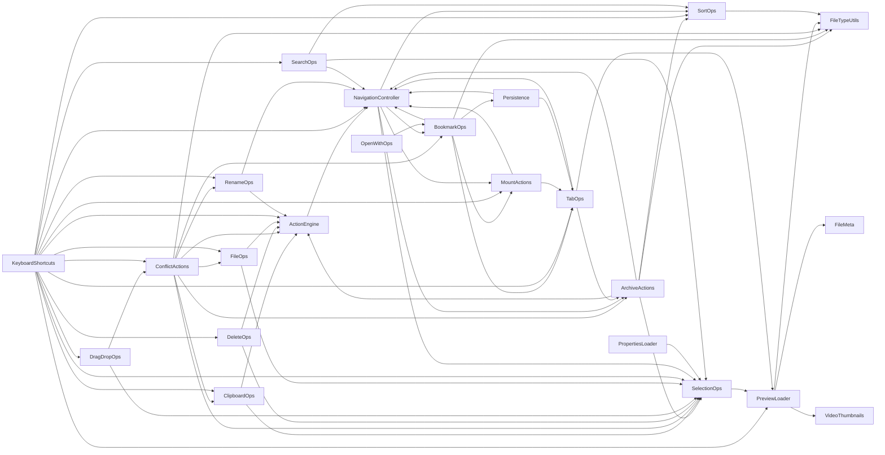

# `logic/` dependency graph

Generated from `property Item x` wiring between `logic/*.qml` components (UI
element/dialog references excluded — this is component-to-component only).
Regenerated 2026-08-09 after **Fase 14.D** (inyección de dependencias
explícita): los controladores dejaron de usar `OmafilesContent` como fachada
genérica y ahora reciben `actionEngine` / `navController` / `fileTypeUtils`
directamente desde `core/ControllerRegistry.qml`. `KeyboardShortcuts` (que se
instancia en `panels/ActiveFileList.qml`, no en el registry) se incluye por
sus inyecciones `host*`.



Hojas (sin dependencias de `logic/`): `FileMeta`, `FileTypeUtils`,
`VideoThumbnails`.

## El grafo YA NO es acíclico (a propósito, desde 14.D)

La versión previa (`core-v1-ready`, 2026-08-05) era acíclica porque
`NavigationController` no era referenciado por nadie: solo lo instanciaba
`OmafilesContent` y los controladores llegaban a la navegación por
`root.refresh()` / `root.navigateTo()` (la fachada del composition root).

Al inyectar `navController` directamente (Fase 14.D, eliminando esos wrappers
`root.*`) aparecen **ciclos de referencia** reales. El núcleo es:

```
NavigationController → { ArchiveActions, BookmarkOps, MountActions }
        ↑______________________________|
```

es decir, `NavigationController` inyecta esos tres controladores **y** los tres
reciben de vuelta `navController`. Hay 18 ciclos distintos derivados de ahí
(p.ej. `NavigationController → MountActions → TabOps → NavigationController`).

**Esto es inocuo en runtime.** Son referencias entre hermanos que el
`ControllerRegistry` resuelve por `id` (QML no exige orden de declaración);
no hay recursión de instanciación ni de llamada. Validado: `--selfcheck`
61/61 y ambos frontends (Quickshell + Qt6) arrancan limpios. La aciclicidad
dejó de ser una invariante alcanzable en cuanto la lógica de navegación pasó
a inyectarse en vez de accederse por la fachada del root, y no aporta valor
perseguirla: rompería el desacoplamiento que buscaba 14.D.

> **Aviso para el siguiente refactor:** no intentes "romper" estos ciclos
> reordenando las instanciaciones del registry ni volviendo a un wrapper
> `root.*`. Los ciclos son de *referencia*, no de *inicialización*, y son la
> consecuencia esperada de la inyección explícita.

## Regenerar este documento

Derivarlo del cableado real del registry (fuente de verdad del ownership):

```
core/ControllerRegistry.qml   # bloques "Componente { id: x; dep: otroId }"
panels/ActiveFileList.qml     # inyecciones host* de KeyboardShortcuts
```

filtrando las auto-referencias de los `readonly property alias X: X` y las
inyecciones `root`/`list` (que apuntan al composition root y a la ListView,
no a otro componente de `logic/`).
