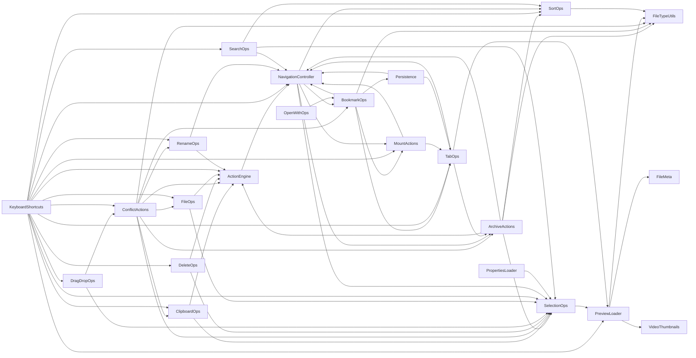

# `logic/` dependency graph

Generated from `property Item x` wiring between `logic/*.qml` components (UI
element/dialog references excluded — this is component-to-component only).
Regenerated 2026-08-09 after **Phase 14.D** (explicit dependency
injection): the controllers stopped using `OmafilesContent` as a generic
facade and now receive `actionEngine` / `navController` / `fileTypeUtils`
directly from `core/ControllerRegistry.qml`. `KeyboardShortcuts` (which is
instantiated in `panels/ActiveFileList.qml`, not in the registry) is included by
its `host*` injections.



Leaves (no `logic/` dependencies): `FileMeta`, `FileTypeUtils`,
`VideoThumbnails`.

## The graph is NO LONGER acyclic (on purpose, since 14.D)

The previous version (`core-v1-ready`, 2026-08-05) was acyclic because
`NavigationController` wasn't referenced by anyone: only
`OmafilesContent` instantiated it and the controllers reached navigation via
`root.refresh()` / `root.navigateTo()` (the composition root's facade).

Injecting `navController` directly (Phase 14.D, removing those `root.*`
wrappers) makes real **reference cycles** appear. The core one is:

```
NavigationController → { ArchiveActions, BookmarkOps, MountActions }
        ↑______________________________|
```

that is, `NavigationController` injects those three controllers **and** the three
receive `navController` back. There are 18 distinct cycles derived from that
(e.g. `NavigationController → MountActions → TabOps → NavigationController`).

**This is harmless at runtime.** They are references between siblings that the
`ControllerRegistry` resolves by `id` (QML doesn't require declaration order);
there is no instantiation nor call recursion. Validated: `--selfcheck`
77/77 and both frontends (Quickshell + Qt6) start clean. Acyclicity
stopped being an achievable invariant as soon as the navigation logic moved
to being injected instead of accessed via the root's facade, and it adds no value
to pursue it: it would break the decoupling that 14.D sought.

> **Notice for the next refactor:** don't try to "break" these cycles
> by reordering the registry's instantiations nor returning to a
> `root.*` wrapper. The cycles are of *reference*, not of *initialization*, and they are the
> expected consequence of explicit injection.

## Regenerating this document

Derive it from the registry's real wiring (source of truth for ownership):

```
core/ControllerRegistry.qml   # "Component { id: x; dep: otherId }" blocks
panels/ActiveFileList.qml     # host* injections of KeyboardShortcuts
```

filtering out the self-references of the `readonly property alias X: X` and the
`root`/`list` injections (which point to the composition root and the ListView,
not to another `logic/` component).
