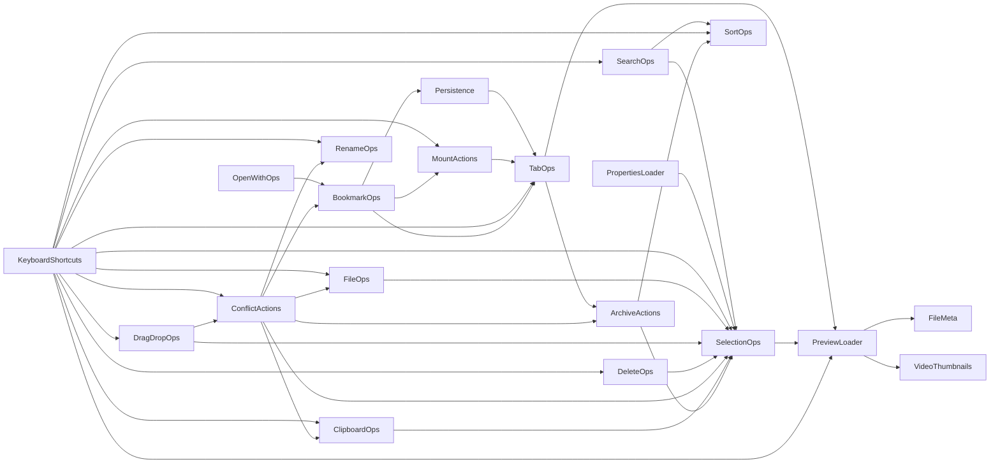

# `logic/` dependency graph

Generated from `property Item x: null` wiring between `logic/*.qml`
components (UI element/dialog references excluded — this is
component-to-component only). Verified acyclic 2026-08-05.



Leaf nodes (no `logic/` dependencies): `ActionEngine`, `FileMeta`,
`FileTypeUtils`, `RenameOps`, `SortOps`, `VideoThumbnails`.

Regenerate by checking, for each `logic/*.qml`:
```
grep -oP 'property Item \K\w+' logic/*.qml
```
then filtering out UI-element/dialog references (anything not itself a
`logic/*.qml` file).
