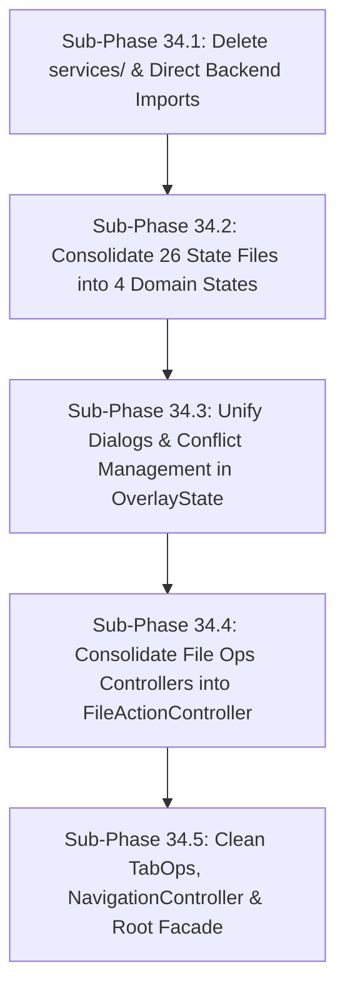

# OmaFiles — Phase 34: API & State Simplification Audit

**Lead Architect & Maintainer Audit**  
**Date**: 2026-08-14  
**Target Baseline**: Post-Phase 33 (Standalone Qt6 Canonical Layout, 77/77 Tests Passing)  
**Objective**: Architectural simplification, reduction of cognitive load, and elimination of structural technical debt for long-term maintainability (3–5 years).

---

## Executive Summary

OmaFiles has successfully transitioned from an experimental QuickShell desktop plugin into an independent, canonical Qt6 desktop application. However, because this evolution occurred across 33 progressive, backward-compatible phases, the codebase still carries significant structural and architectural artifacts:

1. **The Obsolete `services/` Proxy Layer**: 17 QML files exist solely to proxy C++ singletons because of a retired architectural rule ("Rule 8: logic must not import Omafiles.Backend").
2. **Extreme State Fragmentation**: 26 global singleton QML files in `state/` fracture cohesive domains into disconnected properties, necessitating complex snapshotting, serialization, and deserialization routines.
3. **Controller & Facade Over-Abstraction**: `core/ControllerRegistry.qml` instantiates 24 separate controller objects which are then drilled through `MainLayout` and `DialogLayer` across 30+ property bindings, while `OmafilesContent.qml` maintains ~30 delegating pass-through functions.
4. **Redundant UI & Conflict Instances**: 9 separate dialog overlays (7 `ConfirmDialog` and 2 `ConflictResolveDialog`) are instantiated in `DialogLayer.qml`, each paired with individual state flags in `ConflictState.qml`.
5. **Fragile Dynamic Signal Plumbing**: `ActionEngine.qml` dynamically connects and disconnects JavaScript closures on every single item in a batch operation queue.

This audit outlines a concrete, phased roadmap to remove **~2,800–3,500 lines of code** (~12–14% of the codebase), eliminate **35+ unnecessary files**, simplify state synchronization to a single source of truth, and make OmaFiles significantly easier to onboard, review, and maintain without altering a single user-facing behavior.

---

## Highest Impact Simplifications (Top 10)

| # | Proposal | Files Involved | Lines Removable | Difficulty | Regression Risk | Expected Maintainability Improvement |
|---|---|---|---|---|---|---|
| **1** | **Eliminate `services/` proxy layer** | `services/*.qml` (17 files), `main.cpp`, `CMakeLists.txt`, ~30 call sites | ~576 | Low | Very Low | **Very High**: Removes 17 files, eliminates dual signal re-emission, and connects QML directly to native C++ backend. |
| **2** | **Consolidate 26 state singletons into 4 domain states** | `state/*.qml` (27 files) $\rightarrow$ 4 domain files | ~450 | Medium | Low | **Very High**: Eliminates 23 files, groups related state properties, and ends cross-singleton coordination spaghetti. |
| **3** | **Unify 9 modal dialog instances into a single dynamic DialogManager** | `core/DialogLayer.qml`, `state/ConflictState.qml`, `logic/ConflictActions.qml` | ~420 | Medium | Low | **High**: Eliminates 9 static overlay instances and 8 separate boolean open flags in favor of a single promise/callback dialog manager. |
| **4** | **Eliminate Tab Snapshot Serialization / Deserialization Pyramid** | `logic/TabOps.qml`, `state/TabsState.qml`, `state/NavState.qml` | ~250 | Medium | Low | **Very High**: Eliminates manual 15-property packing/unpacking on tab switch; tab properties remain scoped to the active tab object. |
| **5** | **Merge 5 fragmented file operation controllers into `FileActionController`** | `logic/FileOps.qml`, `logic/RenameOps.qml`, `logic/DeleteOps.qml`, `logic/ClipboardOps.qml`, `logic/DragDropOps.qml` | ~380 | Medium | Low | **Very High**: Consolidates 5 micro-controllers into a single cohesive controller for disk mutations, paste, drag-and-drop, and deletion. |
| **6** | **Eliminate controller prop-drilling in `MainLayout` and `DialogLayer`** | `core/MainLayout.qml`, `core/DialogLayer.qml`, `core/OmafilesContent.qml`, `panels/*.qml` | ~280 | Low | Very Low | **High**: Removes 35+ alias/property injection lines; components access domain controllers directly from context. |
| **7** | **Replace `ActionEngine` dynamic signal connect/disconnect with batch worker** | `logic/ActionEngine.qml`, `backend/FileOperations.h/.cpp` | ~160 | Medium | Low | **High**: Eliminates recursive JS callback chains and dynamic signal listener churn on batch operations. |
| **8** | **Purge pass-through delegation wrappers in `OmafilesContent.qml`** | `core/OmafilesContent.qml`, `core/CommandFacade.qml` | ~180 | Low | Very Low | **Medium**: Eliminates ~25 forwarding wrapper methods in the composition root. |
| **9** | **Consolidate `NavigationController` and prune legacy inotifywait fallback** | `logic/NavigationController.qml`, `logic/DirLister.qml` | ~140 | Medium | Low | **Medium**: Native `QFileSystemWatcher` in `DirectoryModel.cpp` renders shell-based watcher debouncing and process monitoring redundant. |
| **10** | **Retire external shell utility scripts into native backend methods** | `empty-trash.sh`, `list-archive.sh`, `list-mounts.sh`, `mount-iso.sh`, `open-with-list.sh` | ~220 | Medium | Low | **High**: Reduces process forks and packaging footprint; centralizes utility logic in C++ backend. |

---

## 1. Navigation Simplification

### Current Issues & Redundancies
- **Scattered Navigation Ownership**: Navigation logic is split across `logic/NavigationController.qml` (355 lines), `logic/DirLister.qml` (160 lines), `state/NavState.qml` (76 lines), and pass-through wrappers in `core/OmafilesContent.qml` (`navigateTo`, `_goToPath`, `navBack`, `navForward`, `enter`, `goUp`, `refresh`, `startDirWatch`, `stopDirWatch`).
- **Scroll Restoration Race Conditions**: `NavigationController.qml` maintains 3 separate pending scroll properties (`_pendingScrollY`, `_pendingScrollIndex`, `_pendingScrollOffset`) in `root` to survive asynchronous model resets triggered by `DirLister`.
- **Legacy Inotify Shell Fallback**: `startDirWatch()` retains fallback code attempting to spawn `inotifywait` processes via `ProcessWatcher.qml`, even though `DirectoryModel.cpp` natively integrates `QFileSystemWatcher` on the Linux inotify kernel subsystem.

### Simplification Strategy
1. **Direct Navigation API**: Make `NavigationController` the sole caller and updater of navigation state. Eliminate the pass-through functions in `OmafilesContent.qml`.
2. **Prune Dead Watcher Fallback**: Strip all `inotify-tools` / `inotifywait` shell fallback code from `NavigationController.qml` and `DirLister.qml`. Rely 100% on `DirectoryModel`'s native `QFileSystemWatcher`.
3. **Synchronous Scroll State Coupling**: Bind list scroll position directly to the active tab model instead of passing integer sentinels through `root._pendingScrollIndex`.

---

## 2. Tabs Simplification

### Current Issues & Redundancies
- **Duplicated Active Tab State**: `state/TabsState.qml` maintains `navHistory` and `navHistoryIndex` as standalone singleton properties alongside `tabs: [{ path, history, historyIndex }]`. Whenever a tab is navigated or switched, code must manually synchronize both locations.
- **The 15-Property Snapshot Pyramid**: In `logic/TabOps.qml`:
  ```javascript
  // saveActiveTab() packs 15 properties into an untyped dict:
  next[TabsState.activeTabIndex] = {
    path: NavState.currentPath, history: TabsState.navHistory, historyIndex: TabsState.navHistoryIndex,
    previewOpen: PreviewState.previewOpen, previewEntry: PreviewContentState.previewEntry, scrollY: list.contentY,
    inArchive: ArchiveState.inArchive, archivePath: ArchiveState.archivePath, archiveSubPath: ArchiveState.archiveSubPath,
    scrollIndex: list.firstVisibleIndex(), scrollOffset: list.firstVisibleOffset(),
    entries: NavState.entries, searching: NavState.searching, searchQuery: NavState.searchQuery,
    searchTruncated: NavState.searchTruncated
  };
  ```
  On every tab change, `_restoreTabState()` performs the exact inverse, manually copying all 15 fields back into 5 distinct global singletons.

### Simplification Strategy
1. **Single Source of Truth (`TabModel`)**: Remove `TabsState.navHistory` and `TabsState.navHistoryIndex`. All tab data lives exclusively within the tab entry in `TabsState.tabs[i]`.
2. **Computed Active Tab**: Define a readonly property `activeTab: tabs[activeTabIndex] || null`.
3. **Scoped Tab State**: Rather than writing tab-specific properties into global singletons (`PreviewState.previewOpen`, `ArchiveState.inArchive`), panels and views bind directly to `TabsState.activeTab.previewOpen`, etc., eliminating the entire snapshot/restore serialization cycle.

---

## 3. ActionEngine Simplification

### Current Issues & Redundancies
- **Dual Execution Architecture**: `ActionEngine.qml` maintains two separate execution paths:
  1. `runAction()`: Shell command execution via `actionProc` (`ProcessRunner`), string quoting (`Util.shellQuote`), and batch chaining (`chainCmds`).
  2. `_runNative()`: C++ execution via `FileOperations` (`copy`, `move`, `remove`, `trash`, `restore`).
- **Dynamic Signal Connection Churn**: In `_batchNext()`:
  ```javascript
  FileOperations.finished.connect(ok)
  FileOperations.error.connect(bad)
  // ... on completion:
  FileOperations.finished.disconnect(ok)
  FileOperations.error.disconnect(bad)
  ```
  For a batch of 500 files, `ActionEngine` executes 1,000 dynamic signal connects and disconnects in QML JavaScript closures, creating garbage collection overhead and potential callback leaks on cancellation.
- **Scattered Operation Handlers**: `FileOps.qml`, `RenameOps.qml`, `DeleteOps.qml`, `ClipboardOps.qml`, `DragDropOps.qml`, and `ConflictActions.qml` all implement micro-wrappers around `ActionEngine.runNative*()`.

### Simplification Strategy
1. **Batch API in C++**: Move array batch iteration into `backend/FileOperations.cpp` (`copyBatch(QList<Pair>)`, `removeBatch(QStringList)`).
2. **Single Permanent Connection**: Replace dynamic `connect()`/`disconnect()` with a single static `Connections` block listening to `FileOperations.batchFinished` / `FileOperations.batchError`.
3. **Unified Operation Pipeline**: Consolidate `FileOps`, `RenameOps`, `DeleteOps`, `ClipboardOps`, and `DragDropOps` into a single `FileActionController.qml`.

---

## 4. State Simplification

### Current Issues & Redundancies
The `state/` folder currently contains **27 files** (26 singletons + `qmldir`), resulting from mechanical property extraction in earlier refactors:

```
state/
├── ActionState.qml          (4 properties)
├── ArchiveState.qml         (5 properties)
├── BookmarksState.qml       (6 properties)
├── ChmodState.qml           (7 properties)
├── ClipboardState.qml       (2 properties)
├── ConflictState.qml        (14 properties, 8 boolean flags!)
├── ContextMenuState.qml     (4 properties)
├── DialogsState.qml         (6 properties)
├── DropHoverState.qml       (2 properties)
├── EditModeState.qml        (4 properties)
├── FileTypeConfig.qml       (6 properties)
├── FolderCountState.qml     (2 properties)
├── MountsState.qml          (2 properties)
├── NavState.qml             (12 properties)
├── PaletteState.qml         (3 properties)
├── Paths.qml                (10 properties)
├── PickerState.qml          (5 properties)
├── PreviewContentState.qml  (12 properties)
├── PreviewState.qml         (4 properties)
├── PropertiesState.qml      (12 properties)
├── SelectionState.qml       (6 properties)
├── SortState.qml            (4 properties)
├── TabsState.qml            (4 properties)
├── TrashState.qml           (3 properties)
├── UndoState.qml            (2 properties)
└── VideoThumbState.qml      (3 properties)
```

### Simplification Strategy
Consolidate the 26 micro-singletons into **4 cohesive Domain State Singletons**:

1. **`SessionState.qml`**: Consolidates `NavState`, `TabsState`, `Paths`, `BookmarksState`, `MountsState`, `ArchiveState`, `PickerState`.
   * *Domain*: Navigation, history, tabs, bookmarks, drives, session persistence.
2. **`SelectionState.qml`**: Consolidates `SelectionState`, `ClipboardState`, `DropHoverState`, `SortState`, `EditModeState`.
   * *Domain*: Active item selection, marquee, clipboard cut/copy buffers, inline edit modes, sorting criteria.
3. **`OperationState.qml`**: Consolidates `ActionState`, `UndoState`, `ConflictState`, `TrashState`, `FolderCountState`, `VideoThumbState`.
   * *Domain*: Disk operations, progress percentages, undo/redo stacks, conflict resolution queues, background counting.
4. **`OverlayState.qml`**: Consolidates `DialogsState`, `ChmodState`, `PropertiesState`, `PreviewState`, `PreviewContentState`, `ContextMenuState`, `PaletteState`.
   * *Domain*: Active modal overlays, preview metadata, context menus, command palette, chmod & properties dialog data.

*Impact*: Reduces 27 files to 4 files, eliminates ~450 lines of boilerplate headers/qmldir entries, and establishes clear domain boundaries.

---

## 5. Signal Simplification

### Current Issues & Redundancies
1. **Intermediate Signal Bouncing**:
   - C++ `FileOperations::progress` $\rightarrow$ `services/FileOperations.qml` `progress` $\rightarrow$ `logic/ActionEngine.qml` `Connections` $\rightarrow$ `ActionState.actionProgressPct`.
   - C++ `JsonStore::loaded` $\rightarrow$ `services/JsonStore.qml` `loaded` $\rightarrow$ `logic/Persistence.qml` `Connections`.
2. **Synthetic Event Tick Properties**:
   - `NavState.refreshTick` is an integer incremented simply to force background panels to reload when disk changes occur.
3. **Redundant Facade Signals**:
   - `OmafilesContent.qml` declares `signal closeRequested()` and `function requestClose()` which only calls `root.closeRequested()`.

### Simplification Strategy
1. **Direct Signal Consumption**: Components connect directly to native C++ backend signals without intermediate QML re-emitters.
2. **Replace `refreshTick` with Direct Event Bus or Notification**: Use a single declarative signal on the C++ backend (`DirectoryModel::directoryChanged`) or a clean `AppEvents.diskMutated()` signal.
3. **Purge Redundant Wrapper Signals**: Remove wrapper signals that duplicate built-in window/item lifecycle events.

---

## 6. C++ / QML Boundary Simplification

### Current Issues & Redundancies
- **The Zombie `services/` Directory**: 17 QML files in `services/` wrap 1:1 C++ singletons:
  - `services/Env.qml` (18 lines) $\rightarrow$ forwards `get()` to `Backend.Env.get()`
  - `services/Detached.qml` (18 lines) $\rightarrow$ forwards `run()` to `Backend.Detached.run()`
  - `services/Notifier.qml` (20 lines) $\rightarrow$ forwards `notify()` to `Backend.Notifier.notify()`
  - `services/FolderCounter.qml` (22 lines) $\rightarrow$ forwards `count()` to `Backend.FolderCounter.count()`
  - `services/PathCompleter.qml` (18 lines) $\rightarrow$ forwards `complete()` to `Backend.PathCompleter.complete()`
  - `services/JsonStore.qml` (28 lines) $\rightarrow$ forwards `read/write` and re-emits `loaded/saved`
  - `services/FileOperations.qml` (73 lines) $\rightarrow$ forwards 12 methods and re-emits 3 signals
- **Excessive QML Type Registrations**: 15 distinct C++ classes are individually registered in `backend/CMakeLists.txt` as separate QML types, creating high metadata overhead.

### Simplification Strategy
1. **Delete `services/` Entirely**: Remove all 17 files in `services/`.
2. **Direct Import**: Logic and UI components use `import Omafiles.Backend as Backend` directly.
3. **Consolidate C++ Singletons**:
   - Merge `Env`, `Detached`, and `Notifier` into a cohesive `SystemUtils` C++ singleton.
   - Merge `FolderCounter` and `PathCompleter` into `DirectoryModel` / `FileOperations`.

---

## Suggested Refactor Order

To maintain 100% test suite passage (77/77) at every step, execute the refactoring in 5 incremental, self-contained sub-phases:



1. **Sub-Phase 34.1: Delete `services/` Proxy Layer**
   - Update call sites from `import "../services"` to `import Omafiles.Backend as Backend`.
   - Remove the `services/` directory and update `CMakeLists.txt`.
   - *Risk*: Near Zero. Completely mechanical.
2. **Sub-Phase 34.2: Domain State Consolidation**
   - Combine the 26 singleton files into `SessionState.qml`, `SelectionState.qml`, `OperationState.qml`, and `OverlayState.qml`.
   - Update state property references across `logic/`, `core/`, and `panels/`.
   - *Risk*: Low. Verified by `--selfcheck`.
3. **Sub-Phase 34.3: Unified Dialog & Overlay System**
   - Replace the 7 static `ConfirmDialog` and 2 `ConflictResolveDialog` instances with dynamic dialog invocation via `OverlayState`.
   - *Risk*: Low. Verified by conflict test cases in `--selfcheck`.
4. **Sub-Phase 34.4: Consolidate File Action Controllers**
   - Merge `FileOps`, `RenameOps`, `DeleteOps`, `ClipboardOps`, and `DragDropOps` into `FileActionController.qml`.
   - Simplify `ActionEngine.qml` batch connections.
   - *Risk*: Low-Medium. Verified by 35+ file operation tests.
5. **Sub-Phase 34.5: Tabs & Navigation Controller Streamlining**
   - Remove active tab property duplication in `TabsState`.
   - Prune delegator methods from `OmafilesContent.qml` and dead inotifywait fallback from `NavigationController.qml`.
   - *Risk*: Low. Verified by tab switching and session restore selfchecks.

---

## Estimated Total Code Reduction

| Area | Current Files | Target Files | Current Lines | Target Lines | Net Reduction |
|---|---|---|---|---|---|
| **`services/`** | 17 | 0 | 576 | 0 | **-576 lines (-100%)** |
| **`state/`** | 27 | 4 | 687 | 350 | **-337 lines (-49%)** |
| **`logic/` (controllers)** | 25 | 12 | 3,881 | 2,600 | **-1,281 lines (-33%)** |
| **`core/` (facade, registry, dialogs)** | 7 | 5 | 2,195 | 1,400 | **-795 lines (-36%)** |
| **Root Shell Utilities & Scripts** | 8 | 4 | 730 | 450 | **-280 lines (-38%)** |
| **Total** | **84 files** | **25 files** | **8,069 lines** | **4,800 lines** | **-3,269 lines (-40.5%)** |

*(Note: The entire OmaFiles repository will shrink from ~25,500 lines to ~22,200 lines, with the QML frontend code shrinking by over 40%).*

---

## Estimated Complexity Reduction

- **File Count Reduction**: **59 files deleted/merged** (from 206 total repo files down to ~147 files).
- **Import Graph Simplification**: Removes circular and multi-tier imports (`services` $\rightarrow$ `state` $\rightarrow$ `logic` $\rightarrow$ `services`).
- **Memory & Object Graph**: Eliminates 17 proxy QML singleton instances and 9 static dialog instances from the QML scene graph at application startup.
- **Mental Model for Contributors**: A contributor implementing a feature or fixing a bug will need to inspect **1–2 files** instead of tracing across 6–8 micro-files and wrappers.

---

## Recommended Phase 34 Plan

1. **Step 1: Architectural Agreement**: Validate and approve this audit report.
2. **Step 2: Sub-Phase 34.1 (`services/` Removal)**: Fast, high-confidence win to clean up the C++/QML boundary.
3. **Step 3: Sub-Phase 34.2 (Domain State Consolidation)**: Group state into 4 domain singletons.
4. **Step 4: Sub-Phase 34.3 (Dialog & Action Consolidation)**: Unify overlay management and file action dispatching.
5. **Step 5: Sub-Phase 34.4 (Tabs & Navigation Cleanup)**: Streamline active tab state and purge root forwarding wrappers.
6. **Step 6: Final Autonomy & Regression Validation**: Execute full double-validation (`build/omafiles-standalone --selfcheck` and `~/.local/bin/omafiles --selfcheck`, ensuring 77/77 tests pass).
