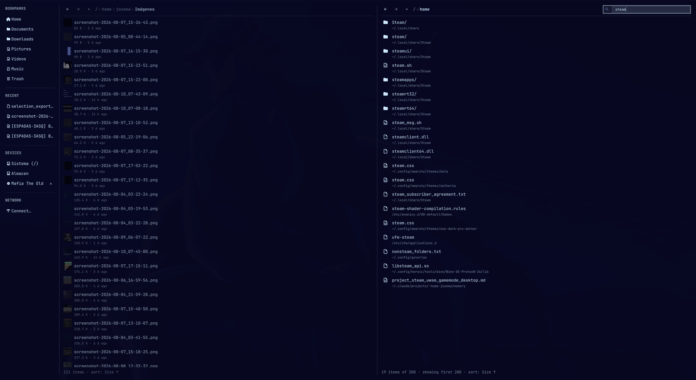

# Omafiles

A keyboard-first file manager for [Omarchy](https://omarchy.org), built as a native Quickshell plugin — not a wrapper around Nautilus/Dolphin/Thunar, and not a layer-shell popup either. It's a real, tileable window that opens and behaves like any other app on your desktop, using Omarchy's own design system (`qs.Commons`/`qs.Ui`) end to end: same typography, same borders, same hover/selection chrome, same Nerd Font icons as the rest of the shell.



## Why

Omarchy is opinionated by design — one good default per decision instead of a wall of settings. Omafiles follows the same spirit: no view-mode dropdowns, no icon-size sliders, no settings panel. Sorting is a key that cycles (`s`/`S`), not a combo box. Everything has a keyboard path first; the mouse works too, but it's not the point.

## Features

- Tiled, real window (`FloatingWindow`) — not a modal overlay, not layer-shell. Lives alongside your terminal/editor like a normal app.
- Vim-style keyboard navigation (`j`/`k`, `gg`/`G`, `h`/`l`), plus arrow keys.
- Command palette (`:` or `Ctrl+P`) for every action, fuzzy-searchable.
- Tabs, editable bookmarks, mounted-drives sidebar (mount/eject, distinguishes internal disks from removable/USB by icon).
- Sort by name/size/date/type — a key cycles it, no dropdown.
- Rename, new folder, delete (to trash, with confirm), copy/cut/paste — **with conflict handling** (overwrite/skip/cancel instead of silently failing).
- Undo (`Ctrl+Z`) for rename, new folder, delete, and move.
- Archive compress/extract (zip/7z/rar/tar family), bulk rename with `{name}`/`{ext}`/`{n}` patterns, chmod, a read-only Properties panel (real folder size via `du`, permissions, owner, dates).
- Image and video thumbnails (video via `ffmpegthumbnailer`, cached).
- Recursive search, "open with", context menus everywhere.
- Every icon is a verified Nerd Font glyph (checked against the installed font's cmap) — no emoji.
- Registers itself as the system's default file manager on first load — no manual setup (see below).
- Drag and drop: drag files out to other apps, drag files in from other apps to copy them here, or drag between folders/bookmarks/drives inside Omafiles to move them — with the same overwrite/skip conflict handling as copy/paste.

## Keyboard shortcuts

| Key | Action |
| --- | --- |
| `j` / `k` / `↓` / `↑` | Move down / up |
| `h` / `Backspace` | Go up a directory |
| `l` / `Enter` | Open (enter directory / launch file) |
| `gg` / `Shift+G` | Jump to top / bottom |
| `Space` | Toggle preview |
| `/` | Search here (`Ctrl+Enter` searches recursively) |
| `:` / `Ctrl+P` | Command palette |
| `Ctrl+A` | Select all |
| `F2` | Rename |
| `Delete` | Delete (to trash) |
| `Ctrl+C` / `Ctrl+X` / `Ctrl+V` | Copy / cut / paste |
| `Ctrl+Z` | Undo |
| `s` / `Shift+S` | Cycle sort field / reverse order |
| `Ctrl+L` | Edit path directly |
| `Ctrl+Shift+N` | New folder |
| `Ctrl+T` / `Ctrl+W` / `Ctrl+Tab` | New tab / close tab / next tab |
| `Ctrl+H` | Toggle hidden files |
| `Shift+Enter` | Open a terminal here |
| `F5` | Refresh |
| `Escape` | Close preview, or close the window |

## Installation

```bash
omarchy plugin add https://github.com/Percius04/omafiles --enable
```

Or clone it manually:

```bash
git clone https://github.com/Percius04/omafiles ~/.config/omarchy/plugins/omafiles
omarchy plugin enable io.github.percius04.omafiles
```

Then bind a key in `~/.config/hypr/bindings.lua`:

```lua
o.bind("SUPER + ALT + F", "Omafiles (file manager)", "omarchy-shell shell toggle io.github.percius04.omafiles '{}'")
```

## Default file manager

Enabling the plugin sets Omafiles as the system's default file manager automatically — nothing to run by hand. On first load it registers both handoff mechanisms Linux apps use for "the" file manager:

- **Opening directories** (`xdg-open`, "Open folder" actions): a `~/.local/share/applications/omafiles.desktop` with `MimeType=inode/directory`, set via `xdg-mime default`.
- **"Show in file manager"** (Firefox downloads, GTK/Qt "reveal in folder"): these go over the `org.freedesktop.FileManager1` D-Bus interface, not `.desktop`/`xdg-mime`, and Nautilus normally owns it. Omafiles ships a user-level service file for the same bus name (`~/.local/share/dbus-1/services/`), which takes priority over Nautilus's system one, backed by `scripts/dbus-filemanager1.py` (needs `python-gobject`/`Gio` — already a dependency of most GTK-based desktops).

This is idempotent and only runs once (tracked in `~/.local/state/omafiles/integrations-version`), so it won't fight you if you later switch the default back by hand. If you ever want to undo it: `xdg-mime default nautilus.desktop inode/directory`, then remove the two files above.

## Requirements

- Omarchy 4 (Quickshell-based shell).
- `ffmpegthumbnailer` for video thumbnails (optional — falls back gracefully without it).
- `gio`, `udisksctl`, standard coreutils (all present on a stock Omarchy install).

## Status

Under active development — feedback and issues welcome.

## License

MIT — see [LICENSE](LICENSE).
