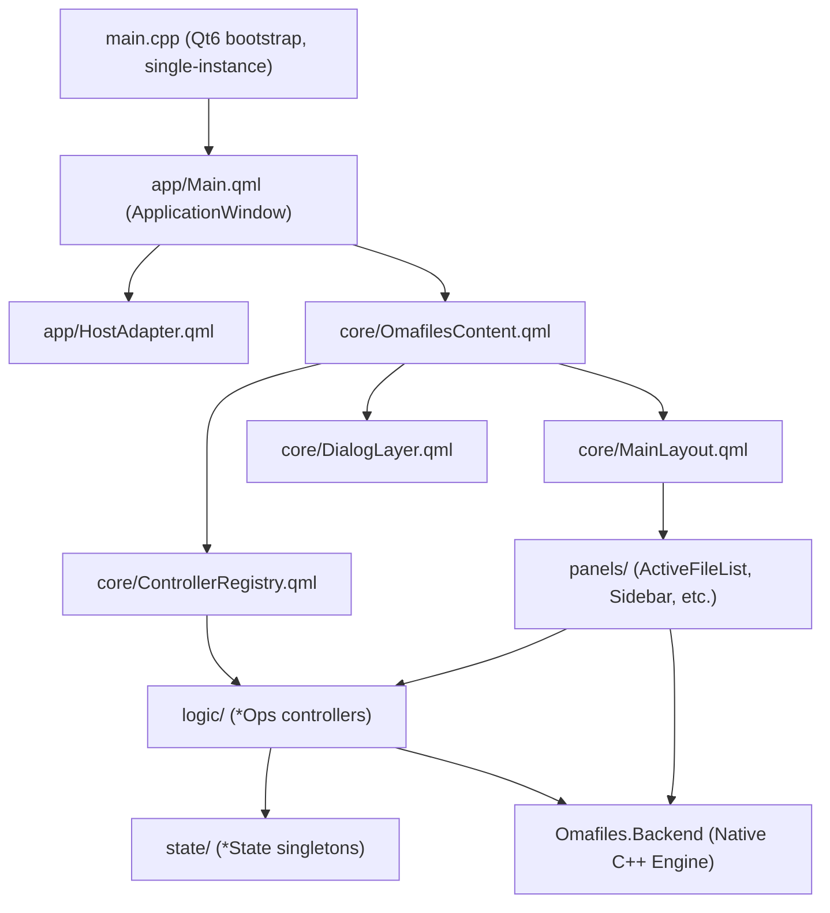

# OmaFiles Architecture

OmaFiles is a standalone Qt6/QML file manager for Linux desktop environments, engineered for speed, responsiveness, and seamless desktop integration.

---

## Directory Structure

```
main.cpp                        Qt6 bootstrap: single-instance IPC, QML engine, --selfcheck
app/                            Application window host and design system adapters
  Main.qml                      Root ApplicationWindow
  HostAdapter.qml               Window lifecycle and geometry persistence
  qml_modules/qs/               Theme provider and visual components (qs.Commons, qs.Ui)
core/                           Composition root and high-level layout orchestration
  OmafilesContent.qml           Composition root wiring all subsystems
  ControllerRegistry.qml        Central owner of logic controllers
  MainLayout.qml                Visual structure (Sidebar, ActiveFileList, BackgroundPanels)
  DialogLayer.qml               Modal dialog overlays
  CommandFacade.qml             Command palette and empty-area action facade
  AppBindings.qml               Reactive hardware events and startup desktop integration
backend/                        Native C++ Qt6 plugin (Omafiles.Backend)
  FileOperations.cpp/.h         Native file I/O (copy, move, delete, trash, restore, chmod)
  DirectoryModel.cpp/.h         Fast directory listing and inotify watching
  ThumbnailProvider.cpp/.h      Image, PDF, and video thumbnail generation with disk cache
  PreviewProvider.cpp/.h        Fast text preview reader
  ProcessRunner.cpp/.h          Asynchronous process runner (QProcess)
  ProcessWatcher.cpp/.h         Line-buffered process monitor (QProcess)
  JsonStore.cpp/.h              Atomic JSON persistence
  UDisksWatcher.cpp/.h          D-Bus UDisks2 device hotplug monitor
  NetworkMounts.cpp/.h          GVfs network mount enumerator
  FolderCounter.cpp/.h          Asynchronous directory item counter
  PathCompleter.cpp/.h          Filesystem path tab completion
  SearchWorker.cpp/.h           Recursive search worker thread
logic/                          Modular operations controllers
  NavigationController.qml      Directory navigation and history management
  DirLister.qml                 Directory listing coordinator
  ActionEngine.qml              File operations and undo/redo stack
  SearchBackend.qml             Indexed and recursive search coordinator
  DeleteOps.qml, RenameOps.qml, ClipboardOps.qml, DragDropOps.qml, FileOps.qml, ...
state/                          Reactive state holders (pragma Singleton)
  NavState.qml, TabsState.qml, SelectionState.qml, UndoState.qml, Paths.qml, ...
panels/                         Persistent UI panels (ActiveFileList, BackgroundPanel, Sidebar, PreviewPanel)
dialogs/                        Modal and floating dialogs (Chmod, Conflict, ConnectServer, etc.)
shared/                         Reusable visual atoms and widgets
scripts/                        D-Bus portal backends and desktop service registration
src/selfcheck/                  Headless regression and validation test suite
```

---

## Architectural Layers



---

## Architectural Principles & Dependency Rules

1. **Direct Native Backend (`Omafiles.Backend`)**: QML components interact directly with native C++ singletons and instantiable types registered by `qt_add_qml_module`. There are no intermediate QML wrapper layers or pass-through proxies.
2. **Modular Controllers (<300 Lines Limit)**: Responsibilities are divided into discrete, cohesive controllers (`DeleteOps`, `RenameOps`, `ClipboardOps`, `DragDropOps`, `FileOps`, `MountActions`, `NavigationController`, `PropertiesLoader`). No monolithic controller merges are permitted.
3. **Controller Registry**: `core/ControllerRegistry.qml` instantiates domain controllers and passes them to `MainLayout`, `DialogLayer`, and `CommandFacade`.
4. **Clean Layering**:
   - `logic/` never imports `panels/`, `dialogs/`, `shared/`, or `core/`.
   - `dialogs/` and `shared/` never import `state/` or `logic/` directly; they receive inputs via properties and callbacks.
   - `state/` singletons contain reactive properties only, importing only `QtQuick` and `Omafiles.Backend`.
5. **Canonical XDG Compliance**: User configuration is read from `$XDG_CONFIG_HOME/omafiles`, cache from `$XDG_CACHE_HOME/omafiles`, and state from `$XDG_STATE_HOME/omafiles`. Resources (.sh scripts, QML, assets) are located via `Paths.resourceDir` resolved at startup.

---

## Desktop Integrations & D-Bus Services

- **File Manager Service**: `org.freedesktop.FileManager1` integration (`scripts/dbus-filemanager1.py`) allows browsers and desktop apps to trigger "Show in folder".
- **File Chooser Portal**: `org.freedesktop.impl.portal.FileChooser` integration (`scripts/dbus-filechooser.py`) provides native file-picker dialogs for Wayland sandboxed applications.
- **Auto-registration**: `scripts/install-integrations.sh` idempotently registers the `.desktop` file and D-Bus services into standard XDG user directories.

---

## Historical Architecture Notes (Archival)

- **Decoupling from Shell Plugins**: OmaFiles originally originated as a shell plugin before being decoupled into an independent Qt6 standalone application with its own native C++ core (`Omafiles.Backend`).
- **Proxy Layer Removal (Phase 34.1)**: The intermediate `services/` QML proxy layer was retired in favor of direct namespaced QML imports (`import Omafiles.Backend as Backend`), reducing signal relay boilerplate and simplifying the call graph.

## Post-Phase 43 Module Guidelines

### `logic/` vs `engine/`
In Phase 43, `ActionEngine.qml` absorbed the vast majority of the application's file operation logic, effectively replacing a multitude of `*Ops.qml` components. `logic/` is no longer a loose collection of operations but rather the core orchestration tier. In future major versions (e.g., v1.0), this directory may be renamed to `engine/` or `actions/` to better reflect its singular orchestration purpose. For the 0.9.x series, the `logic/` nomenclature is retained for stability.

### `shared/` Contract
The `shared/` directory is strictly governed by the following contract to prevent it from devolving into a catch-all directory:
1. **Visual and Utility Reusability Only**: Contains only `Utils.js` and visual components (like `ModalSurface.qml`, `EmptyState.qml`) that are consumed by *multiple* independent panels or views.
2. **No Business Logic**: Components in `shared/` must never contain business logic, invoke backend services directly, or orchestrate file operations.
3. **No State Management**: Components in `shared/` must be entirely stateless, receiving their context exclusively via properties (props) and broadcasting events via signals.

### `scripts/runtime/` Policy
The `scripts/runtime/` directory contains external integrations (shell scripts wrapping CLI utilities like `tar`, `udisksctl`, `ffmpegthumbnailer`) that are **accepted temporarily** to avoid monolithic C++ dependencies (e.g., `libarchive`, `libavformat`) or excessively complex native implementations (e.g., race-condition workarounds for D-Bus). 

**The long-term objective (v1.0+) is to progressively reduce the surface area of these scripts through native implementations whenever the cost/complexity ratio becomes justifiable.** This directory must not become a dumping ground for convenience scripts; any new system capability should default to being natively implemented in C++ unless doing so introduces a severe architectural or dependency penalty.
