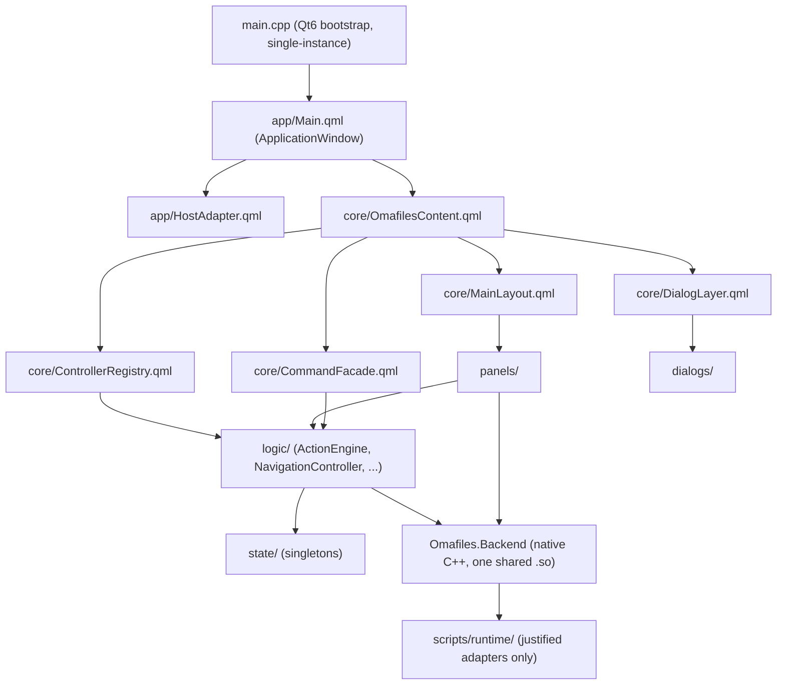

# OmaFiles Architecture

OmaFiles is a standalone Qt6/QML file manager for Linux desktop environments.
This document describes the architecture **as it exists in the repository
today** (regenerated 2026-08-17, after the P0/P1 architectural-audit
remediation passes). Historical planning documents and phase-by-phase reports
live in `docs/historical/`; this file and its siblings in
`docs/architecture/` describe current reality only.

There is a single frontend: the Qt6 standalone application (`main.cpp` +
`app/`). An earlier Quickshell frontend and its `services/`/`integrations/`
adapter layers existed for a period (see `docs/historical/`) and were
deliberately removed once the standalone frontend was proven complete — do
not reintroduce them; see "What was tried and abandoned" below.

---

## Directory Structure

```
main.cpp                        Qt6 bootstrap: single-instance IPC, QML engine, --selfcheck
app/                             Application window host
  Main.qml                       Root ApplicationWindow
  HostAdapter.qml                Window lifecycle and geometry persistence
  SelfCheck.qml                  Thin entry point for the --selfcheck harness
  qml_modules/qs/                Local design-system modules (qs.Commons, qs.Ui) -- NOT Quickshell
core/                             Composition root and high-level layout orchestration
  OmafilesContent.qml             Composition root: instantiates ControllerRegistry, MainLayout, DialogLayer
  ControllerRegistry.qml          SOLE owner/instantiator of every logic/ controller
  MainLayout.qml                  Visual structure (Sidebar, ActiveFileList, BackgroundPanels)
  DialogLayer.qml                 Modal dialog/overlay layer
  CommandFacade.qml               Maps UI intent (palette, item/empty-area actions) to ActionEngine calls
  AppBindings.qml                 Reactive hardware events, self-registration as default file manager
  FilePickerBar.qml               GTK/portal file-picker embedding
  PathCompletionField.qml         Address bar with native autocompletion (Ctrl+L) -- moved here from shared/
                                   (P2.1, 2026-08-17), its only consumer, to resolve a shared/-contract violation
backend/                         Native C++ Qt6 plugin (Omafiles.Backend, one shared .so)
  FileOperations.*, FileOpsPrivate.h   Native file I/O (copy/move/remove/trash/restore/rename/mkdir)
  DirectoryModel.*                Directory listing + QFileSystemWatcher
  SearchWorker.*                  Recursive name/content search worker
  ThumbnailProvider.*             Image/PDF thumbnail generation + disk cache
  PreviewProvider.*, SyntaxHighlighter.*, MediaInfo.*   Text/syntax preview, audio/video metadata
  MimeResolver.*, NetworkResolver.*, NetworkMounts.*, TerminalResolver.*, PathCompleter.*
  ProcessRunner.*, ProcessWatcher.*, Detached.*, Env.*, Notifier.*, JsonStore.*, UDisksWatcher.*, FolderCounter.*, GioCompat.h
logic/                           Orchestration controllers (one shared owner: core/ControllerRegistry.qml)
  ActionEngine.qml                File actions (copy/move/delete/trash/rename/chmod/link/archive) + undo/redo + batch/progress
  NavigationController.qml        Directory navigation, history, tab restore glue
  DirLister.qml                   Thin adapter over Backend.DirectoryModel (stable logic/ API)
  KeyboardShortcuts.qml            Keys.onPressed routing for the active panel (instantiated in panels/ActiveFileList.qml)
  SearchOps.qml, SearchBackend.qml Live-filter + indexed/recursive deep search coordination
  TabOps.qml                      Tab lifecycle, per-tab scroll/preview/archive state restore
  MountActions.qml                Removable device + network mount actions
  Persistence.qml                 Bookmarks/recents/session JSON persistence (Backend.JsonStore)
  PreviewLoader.qml, FileMeta.qml, VideoThumbnails.qml   Preview pipeline
  PropertiesLoader.qml            Properties panel data (size/permissions/owner)
  CustomActions.qml               User-defined custom actions
state/                            Reactive state singletons (pragma Singleton, module Omafiles.State)
  26 singletons: NavState, TabsState, SelectionState, SortState, UndoState, ClipboardState,
  ConflictState, ArchiveState, TrashState, MountsState, DialogsState, ActionState,
  PreviewState/PreviewContentState, PropertiesState, ChmodState, EditModeState, ContextMenuState,
  DropHoverState, BookmarksState, FolderCountState, VideoThumbState, PaletteState, PickerState,
  FileTypeConfig, Paths
panels/                          Presentation: ActiveFileList, BackgroundPanel, Sidebar (+3 sub-panels), PreviewPanel, SearchBar, row delegates
dialogs/                         Presentation: BulkRenamePanel, ChmodPanel, CommandPalettePanel, ConflictResolveDialog,
                                  ConnectServer, ContextMenuPanel, OpenWithPanel, PropertiesPanel, ShortcutsHelp
shared/                          Reusable visual atoms/utilities: BreadcrumbSegments, EmptyState, FileRowVisual,
                                  MarqueeCatcher, ModalSurface, PanelNavButtons, Utils.js
scripts/runtime/                 Justified external-system adapters (see contract below): list-archive.sh,
                                  list-mounts.sh, mount-iso.sh, search-index.sh, thumbnail-video.sh
scripts/                         install-integrations.sh, open-path.sh, dbus-*.py (D-Bus portal/FileManager1 services)
src/selfcheck/                   Headless regression suite (--selfcheck), 95 checks as of this writing
```

---

## Architectural Layers



Real, current call direction: `UI (panels/dialogs) → CommandFacade / direct calls → ActionEngine (+ other logic/ controllers) → Backend.* (C++) → OS/filesystem`. `state/` is read/written by both `logic/` and the UI layer directly (it is data, not a call target). There is no `services/` indirection layer anymore (see below).

---

## Architectural Principles & Dependency Rules

1. **Direct native backend.** QML imports `Omafiles.Backend` (a single shared `.so`, `qt_add_qml_module`) and calls it directly. No intermediate proxy/wrapper layer exists or is wanted — a `services/` adapter layer existed for a period and was deliberately removed (Phase 34.1) once it became pure indirection with no remaining reason to exist (see "What was tried and abandoned").
2. **`core/ControllerRegistry.qml` is the sole owner of `logic/` controllers.** It instantiates every controller once and injects them by property into `MainLayout`, `DialogLayer`, and `CommandFacade`. Nothing else instantiates a `logic/` controller. `KeyboardShortcuts` is the one controller instantiated elsewhere (`panels/ActiveFileList.qml`, injected with `host*`-prefixed properties) because it needs direct `Keys.onPressed` access to the active `ListView`.
3. **Clean layering, checked, not assumed:**
   - `logic/` never imports `panels/`, `dialogs/`, or `core/`.
   - `dialogs/` and `shared/` must never import `state/` or `Omafiles.Backend` directly; they receive data via properties and emit intent via signals. Both known violations were resolved in the P2.1 architectural-cleanup pass (2026-08-17): `shared/MarqueeCatcher.qml` now takes an injected `marqueeTarget` (any object exposing `startMarquee`/`moveMarquee`/`endMarquee` — `SelectionState` today) instead of importing `state/` directly; `PathCompletionField.qml` moved to `core/PathCompletionField.qml`, where its sole consumer (`core/MainLayout.qml`) already lived, so the `state/`/`Backend` reads it needs no longer cross the `shared/` boundary at all. Do not add a new one.
   - `state/` singletons hold reactive properties only; business orchestration belongs in `logic/`, not `state/`.
4. **`ActionEngine.qml` is a coordinator, not a monolith to be ashamed of, but also not a precedent for merging more into it.** See "Phase 43: what actually happened" below for the full reasoning.
5. **Canonical XDG compliance.** Config in `$XDG_CONFIG_HOME/omafiles`, cache in `$XDG_CACHE_HOME/omafiles`, state in `$XDG_STATE_HOME/omafiles`. Resources are located via `state/Paths.qml::resourceDir`, resolved at startup by `main.cpp::resolveResourceDir()` (source tree, if present, else the installed data dir, else `$XDG_DATA_HOME/omafiles`) — this is what lets `cmake --install` produce a fully working installation independent of the source tree (verified with a real `DESTDIR` install, see `docs/audits/P0_REMEDIATION_REPORT.md`).

---

## Asynchronous ownership, cancellation, and lifetime model

This is the part of the architecture that had the most real, confirmed bugs
(three separate use-after-frees and a shared-cancellation-state bug — see
`docs/audits/P0_CONCURRENCY_REMEDIATION_REPORT.md` and this repo's
`P1_...` findings). The rules below are not aspirational: they are what the
fixed code actually does, and what any new asynchronous backend type must
replicate.

### Object lifetime (`Life` + mutex pattern)

Every backend type that dispatches work to `QThreadPool` and later delivers
a result back to the UI thread (`FileOperations`, `SearchWorker`,
`ThumbnailProvider`, `DirectoryModel`) follows the same pattern:

```cpp
struct Life { std::mutex mtx; bool alive = true; };
std::shared_ptr<Life> m_life = std::make_shared<Life>();
// destructor:
~T() { std::lock_guard<std::mutex> lk(m_life->mtx); m_life->alive = false; }
```

Rules, in order of how often they were violated before the P0 fix:

1. **The worker-thread job body must never touch `this`.** Not a member
   variable, not a member function — nothing. `DirectoryModel::scan()` is the
   original, correct example: it is declared `static` specifically so it
   cannot. `FileOperations`' job lambdas achieve the same property without
   being `static` methods: they capture cancellation tokens and a
   `ProgressFn` **by value**, never `this`.
2. **`QMetaObject::invokeMethod(this, ...)` may only be called while holding
   `life->mtx`**, acquired via a `shared_ptr<Life>` copy that was captured
   **before** dispatch (on the calling thread, where `this` is still
   guaranteed valid) — never re-read from `this->m_life` on the worker
   thread. Holding the lock blocks the destructor from completing until the
   call returns, which is the entire safety guarantee. A guard that lives
   *inside* the deferred functor instead of *around* the `invokeMethod` call
   is not sufficient — `invokeMethod` itself dereferences `this` to find its
   thread affinity, before the functor ever runs. (This exact mistake was
   found and fixed in `SearchWorker` during the P0 pass; see the doc comment
   on `SearchWorker::search()`.)
3. **`ThumbnailProvider` has no exception to this** despite being the
   "simplest" of the four — it had zero lifetime protection before the P0
   pass (no destructor, no `Life`) and was the only one of the four to
   produce a hard `SIGSEGV` (inside Qt's own event delivery) rather than an
   ASan-flagged soft UAF.

### Cancellation is operation-scoped, never shared

`FileOperations::cancel()` targets **whichever operation started most
recently** — there is one Cancel action in the UI (`ActionEngine.cancelAction()`),
so this matches the UX. What changed (P1-4): each `copy()`/`move()`/
`remove()`/`emptyTrash()`/`restoreByOrigPath()` call gets its **own**
`shared_ptr<std::atomic<bool>>` token via `FileOperations::beginCancelToken()`,
which also becomes the target of the next `cancel()` call. Before this fix, a
single `atomic<bool>` was reused for the whole lifetime of the singleton:
starting a second operation while a first was still finishing silently
reset (and could un-cancel) the first operation's own flag, because both
held a `shared_ptr` to the *same* underlying atomic. `SearchWorker::m_gen`
follows the identical pattern (a generation counter, not a boolean, since a
search can be superseded rather than merely cancelled) for the same reason.

**Any new cancellable async entry point on a backend singleton must mint its
own token/generation at the start of the call, never reuse a plain member.**

### Batch/undo truthfulness

`ActionEngine`'s native batch machinery (`_runNative`/`_batchNext`/
`_finishNative`) tracks `_batchCompleted` — the subset of `_batchQueue` that
genuinely finished — separately from the batch that was *requested*. The
caller's `onDone(completed)` callback always receives this subset, never the
full original list. This matters because a batch can end in three ways
(full success, an item erroring out, or the user cancelling mid-flight), and
before the P1-1 fix, anything other than full success skipped the undo
registration entirely — real completed work (e.g. 2 of 5 files genuinely
moved) got **zero** undo entry. `confirmDelete()`, `runPaste()`, and
`runDrop()` all build their undo/redo closures from `completed`, not from
the original batch, and their label falls back to `"N of M items ..."` when
the two differ.

**Known, deliberately unfixed gap (documented, not silently missed):**
`undoLast()`/`redoLast()` push the *entry itself* onto the opposite stack
(and show "Undoing:"/"Redoing:") as soon as `entry.undo()`/`entry.redo()`
**starts**, not once it is confirmed to have actually completed — "started"
and "succeeded" are different things for every async entry (native or
shell-based). Closing this fully would require every one of the ~10
`pushUndo()` call sites (rename, new file/folder, bulk rename, chmod, make
link, native mkdir, trash, move) to thread a completion callback through
their `undo`/`redo` closures — for native mkdir specifically, `Backend.
FileOperations.mkdir()` has no `onDone` parameter to hook at all. This is a
real, understood gap, not an oversight; fixing it is out of proportion for a
"smallest robust fix" pass and is left for a dedicated follow-up. The
higher-impact half of the same bug class (batches producing zero/wrong undo
entries) **is** fixed.

---

## Desktop Integrations & D-Bus Services

- **File Manager Service**: `org.freedesktop.FileManager1` (`scripts/dbus-filemanager1.py`) — "Show in folder" from browsers/other apps.
- **File Chooser Portal**: `org.freedesktop.impl.portal.FileChooser` (`scripts/dbus-filechooser.py`) — native file-picker for sandboxed/Wayland apps.
- **Auto-registration**: `scripts/install-integrations.sh`, idempotent, registers the `.desktop` entry and D-Bus services.
- **Test hygiene note**: any code path that launches a real external process visible to the user (terminal, default-app launch) must guard on `Backend.Env.get("OMAFILES_SELFCHECK") === "1"` (QML) / `qEnvironmentVariable("OMAFILES_SELFCHECK") == "1"` (C++) the same way `TerminalResolver` and `NavigationController::openWithDefault()` already do — otherwise every `--selfcheck` run spawns real desktop windows (found and fixed 2026-08-17 after it started interrupting a live session).

---

## `scripts/runtime/` contract

Accepted **only** as thin, stable shims over standard Linux CLI tools that
have no clean, low-risk native (`libarchive`/`libblkid`/`libudev`-free)
equivalent. Currently justified:

| Script | Wraps | Why it's still a script, not C++ |
|---|---|---|
| `list-archive.sh` | `unzip`/`7z`/`unrar`/`tar` | 4 archive formats' listing conventions; native would mean linking libarchive or 4 separate format libraries for a browse-only feature |
| `list-mounts.sh` | `lsblk`/`findmnt` | Enumerates **unmounted** removable devices too; `QStorageInfo` only sees already-mounted filesystems, the rest needs `libblkid`/`libudev` |
| `mount-iso.sh` | `udisksctl`/loop devices | One-shot privileged-adjacent operation, already the "correct" system-level tool |
| `search-index.sh` | `plocate`/`tracker3` | External index daemons; wrapping them is strictly better than reimplementing an index |
| `thumbnail-video.sh` | `ffmpegthumbnailer` | Full video decode; would mean linking `libavformat`/`libavcodec` for one thumbnail type |

Anything reachable in pure Qt/C++ without a disproportionate dependency cost
belongs in `backend/` instead — `open-with-list.sh` and `list-network-mounts.sh`
were both retired this way (now `MimeResolver`/`NetworkMounts` in `backend/`).
Do not add a new script here for something a `QFileInfo`/`QMimeDatabase`/
`QStorageInfo` call could already do.

---

## What was tried and abandoned

- **`services/` proxy layer** (one-line QML adapters between `logic/` and
  `Omafiles.Backend`, meant to isolate the backend module's name and support
  a since-removed dual-frontend design): retired Phase 34.1 once it became
  pure indirection. **Do not reintroduce it** "for architectural purity" —
  `logic/` importing `Omafiles.Backend` directly is the current, correct,
  and load-bearing design.
- **Dual Quickshell + Qt6 standalone frontends**: the whole point of
  `core/OmafilesContent.qml` being host-agnostic was originally to support
  both. The Quickshell frontend was built, then deliberately deleted days
  later once the standalone frontend proved sufficient on its own. **Do not
  revive it** without a concrete, current reason — there is no host
  abstraction left to validate against a second host, and adding one back
  speculatively is exactly the kind of premature abstraction this project's
  own history argues against.
- **The `*Ops.qml` decomposition of `ActionEngine`** (`ClipboardOps`,
  `RenameOps`, `DragDropOps`, `FileOps`, `ConflictActions`, `ArchiveActions`,
  `DeleteOps`, and others): merged into `ActionEngine.qml` in a single commit
  described in detail below. Reverting to the old per-file split without a
  concrete plan for *why* would just reintroduce the coordination problem
  the merge was trying to solve, badly.

---

## Phase 43: what actually happened (and the actual lesson)

`logic/ActionEngine.qml` is 1200+ lines. Before drawing a conclusion from
that number alone, the actual history matters:

- The merge (`37f3f318`, 2026-08-15) folded 11 previously-separate,
  clearly-named files into one, as an unreviewed "chore" commit with no
  phase report — **contradicting, in writing, an earlier risk audit of this
  project** (`docs/historical/PHASE34_REMAINING_RISK_AUDIT.md`) that had
  already evaluated and explicitly rejected this exact consolidation as
  "medium risk, negative ROI."
- That same commit introduced a real regression (archive-browsing wiring;
  see `docs/audits/P0_REMEDIATION_REPORT.md`, P0-1) that went undetected for
  a full day because no selfcheck exercised that path.
- **The lesson is not "big files are bad."** `core/ControllerRegistry.qml`
  (Phase 11.C) had already fixed a near-identical "god object" problem — 22
  controllers instantiated ad hoc and used by id — by consolidating
  *ownership*, not *code*: one file instantiates and wires everything, the
  controllers themselves stayed separate. That fix is still in place, still
  correct, and is the actual model to follow if `ActionEngine` is ever split
  again.
- **Phase 41** (splitting `FileOperations.cpp`, `SyntaxHighlighter.cpp`, and
  `MediaInfo.cpp` into per-operation/per-language/per-format files, each
  under the project's own 300–500 line convention, with an independent risk
  review beforehand) is the positive counterexample: decomposition done with
  exactly the discipline the `ActionEngine` merge skipped.
- **What this means going forward:** `ActionEngine` staying large is
  acceptable *as long as it stays a coordinator* (one domain — reversible
  file actions — with many operations) rather than becoming a dumping
  ground for unrelated concerns. It is **not** a precedent for merging
  anything else "because a big file worked out fine here." Any future split
  or merge of `logic/` needs the same kind of explicit, written, independent
  risk review Phase 41 got and the `ActionEngine` merge didn't — see
  `docs/audits/MONOLITH_AUDIT.md` for the full per-file verdicts.

### Why panels/ do not own business operations

`panels/` and `dialogs/` call into `logic/` (via injected controller
references or `CommandFacade`) and render `state/` — they do not implement
file operations themselves, do not call `Omafiles.Backend` directly, and do
not hold undo/cancellation state. This keeps "what actually happens to a
file" auditable from one place (`ActionEngine` + the backend types it
calls) instead of scattered across every view that happens to offer a
delete button.

### Why `state/` singletons stay simple

`state/` singletons are property bags: reactive properties and the signals
Qt generates for them, nothing else. `shared/`'s two former violations of
the adjacent `shared/`-no-`state/`-import rule (`PathCompletionField.qml`,
`MarqueeCatcher.qml`) were resolved in the P2.1 pass — see the dependency
rules above — so there is currently no known live violation of either
contract. Keeping `state/` free of orchestration is what makes it possible
to reason about "who mutates this" without grepping the entire QML tree.
