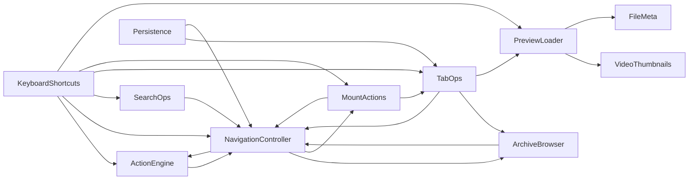

# `logic/` dependency graph

Regenerated 2026-08-17 (architectural-audit P2.3 -- the `ArchiveBrowser`
extraction) against the **current** `logic/` directory (15 files, +1 since
the previous P1-5 regeneration). The previous version of this document
(last regenerated 2026-08-09) described a `logic/` made of ~20 small
`*Ops.qml` controllers — `ClipboardOps`, `RenameOps`, `DragDropOps`,
`FileOps`, `ConflictActions`, `ArchiveActions`, `DeleteOps`, `BookmarkOps`,
`OpenWithOps`, `SelectionOps`, `SortOps` among them. **None of those files
exist anymore** — they were folded into `logic/ActionEngine.qml` in a single
commit (`37f3f318`, 2026-08-15, see `ARCHITECTURE.md`'s "Phase 43" section
and `docs/audits/ARCHITECTURE_EVOLUTION_AUDIT.md`). The graph below reflects
what is actually in the repository today, derived the same way as before:
from `property Item x` / `property var x` wiring in
`core/ControllerRegistry.qml` (the sole owner of every controller except
`KeyboardShortcuts`) plus the `hostControllers.*` accesses in
`logic/KeyboardShortcuts.qml` (instantiated in `panels/ActiveFileList.qml`,
not in the registry).



**`ArchiveBrowser` is new** (architectural audit 2026-08-17, P2.3):
extracted from `ActionEngine.qml` -- archive listing/navigation
(`.zip`/`.7z`/`.rar`/tar browsed without extracting) never used
`runAction()`/`pushUndo()`/the native-batch machinery, the one block with a
genuinely independent lifecycle. `ActionEngine` no longer has any
archive-browsing code or `ArchiveBrowser` reference at all (their previous
shared edge is gone, not replaced); `ActionEngine` keeps only `isIso()`
(ISO mounting is a different mechanism, not archive browsing). The
`NavigationController <-> ArchiveBrowser` cycle is the same accepted
"mutually-aware siblings, resolved by id" shape already documented below
for `NavigationController <-> MountActions`/`TabOps <-> Persistence` — see
"The graph is still cyclic, on purpose". `TabOps` previously depended on
`ActionEngine` *only* for this same archive call and now depends on
`ArchiveBrowser` instead — a genuine, measured coupling reduction: `TabOps`
has zero remaining edges to `ActionEngine`.

Every controller additionally receives `root` (the composition root,
`core/OmafilesContent.qml`) and, where it touches the active listing,
`list` (the real `ListView`-owning `panels/ActiveFileList.qml` instance) --
both injected by `core/ControllerRegistry.qml` and omitted above as they are
not `logic/`-to-`logic/` edges (`ArchiveBrowser` takes `list` for this
reason -- scroll reset on re-listing -- not shown above). `PropertiesLoader`
and `CustomActions` receive only `root` and have no edges to other
controllers. `KeybindingResolver` (P2.5) receives neither `root` nor `list`
nor any other controller -- it only reads `state/Paths.qml`,
`state/KeyboardDefaults.qml`, and `Backend.Notifier`, all outside the
`logic/`-to-`logic/` graph. `DirLister.qml` and `SearchBackend.qml` are thin
adapters directly over `Backend.DirectoryModel`/a native search index and are
not wired into the registry's controller graph at all (they're consumed by
`NavigationController`/`SearchOps` respectively as plain property values,
not as registry-owned singletons).

**Leaves** (no `logic/`-to-`logic/` dependencies of their own):
`VideoThumbnails`, `FileMeta`, `PropertiesLoader`, `CustomActions`,
`KeybindingResolver`, `DirLister`, `SearchBackend`.

## The graph is still cyclic, on purpose (unchanged since Phase 14.D)

`NavigationController` injects `MountActions`, and `MountActions` injects
`NavigationController` back (same for `TabOps` in both directions with
`NavigationController` and with `Persistence`). This is a genuine reference
cycle, not an initialization-order bug: `core/ControllerRegistry.qml`
resolves everything by QML `id`, which does not require declaration order,
and no constructor calls into another controller during creation. Verified
by `--selfcheck` passing clean (95/95 as of this writing) and by the app
starting cleanly.

**Do not try to "fix" this by reordering `ControllerRegistry.qml` or by
reintroducing a `root.*` facade indirection to break the cycle.** That
facade is exactly what Phase 14.D deliberately removed in favor of explicit
injection; the cycles are the expected, harmless consequence of explicit
injection between mutually-aware siblings, not a defect.

## Regenerating this document

Derive it from the registry's real wiring (source of truth for ownership):

```
core/ControllerRegistry.qml   # "Foo { id: x; dep: otherId }" blocks
panels/ActiveFileList.qml     # host* injections of KeyboardShortcuts
logic/KeyboardShortcuts.qml   # grep for `hostControllers\.[a-zA-Z]+` to get its real edges
```

Filter out: self-references (`readonly property alias X: X`), and the
`root`/`list` injections (they point at the composition root and the active
`ListView`, not at another `logic/` component).
