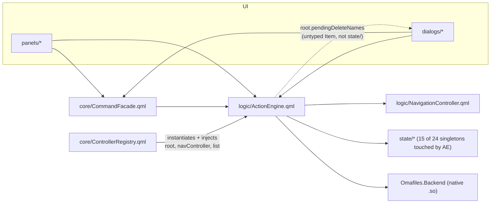

# P2.1 — ActionEngine + shared/ Architectural Audit

**Date:** 2026-08-17
**Scope:** `logic/ActionEngine.qml`, `shared/` (all 8 files), their relationships with `core/CommandFacade.qml`, `state/`, `panels/`, `dialogs/`, and `Omafiles.Backend`, plus `shared/CursorSurface.qml`'s coherence and a design (not implementation) for opt-in alternating rows.
**Method:** every file named above was read in full, not sampled. Dependency edges were verified by direct import/grep inspection of the current tree, not inferred from documentation. Two pre-existing same-week audits (`docs/audits/MONOLITH_AUDIT.md`, dated 2026-08-16, and `docs/audits/ARCHITECTURE_EVOLUTION_AUDIT.md`) already did a deep dive on `ActionEngine.qml`/`CommandFacade.qml`; this document verifies their findings against the *current* tree (several were already fixed by today's P0/P1 remediation, see §7) rather than re-deriving them from scratch, and extends the analysis to the parts those audits didn't cover (`shared/`, `CursorSurface`, a concrete extraction proposal).
**No production code was changed to produce this document.** See "Verification" at the end.

---

## Executive Verdict

**KEEP ACTIONENGINE INTACT**, with two narrowly-scoped, low-risk exceptions that are extractable *without* recreating the Phase 43 failure mode:

1. The archive-browsing block (`enterArchive`/`exitArchive`/`refreshArchiveListing`/`openFileInArchive`/`isArchive`/`isIso` + `archiveListProc`/`archiveOpenProc`, ~115 lines) is the one genuinely separable domain: it never calls `runAction`/`pushUndo`/the native-batch machinery, has its own two `ProcessRunner`s, and its own two state singletons (`ArchiveState`, plus reads of `FileTypeConfig`). It could become `logic/ArchiveBrowsing.qml` with near-zero coupling cost.
2. Four stale comment blocks describing a pre-merge architecture that no longer exists should be corrected (documentation-only, zero behavioral risk, but currently actively misleading).

Everything else in `ActionEngine.qml` — delete/trash, clipboard, rename/new-file/new-folder, bulk-rename, chmod, symlink, drag-drop-conflict resolution, compress/extract-conflict resolution, and the undo/redo + native-batch core — is the same domain (*reversible file mutation, dispatched through one of two execution paths: shell `runAction` or native `_runNative`*) and extracting any of it would either (a) just relocate code with no coupling reduction, because every one of those functions already funnels through the same two execution primitives that must stay together, or (b) recreate exactly the `ActionEngine → Ops wrapper → backend` shape Phase 43 was punished for, this time with each wrapper injected individually into `core/ControllerRegistry.qml` and re-wired at every one of ~50 call sites in `panels/`, `dialogs/`, and `core/CommandFacade.qml`.

`shared/` gets a milder verdict: **REFACTOR PARTIALLY**. Six of eight files are clean, correctly-scoped, zero-violation shared primitives. Two (`MarqueeCatcher.qml`, `PathCompletionField.qml`) already violate the project's own written `shared/` contract (no direct `state/`/`Backend` imports) — a violation `docs/architecture/ARCHITECTURE.md` itself already flags as "known, tracked, deliberately not fixed... do not add a third." This audit does not add a third, and recommends a concrete (but not yet executed) fix shape for the two that exist.

---

## 1–2. ActionEngine Responsibility Matrix

Every function/property/signal in the 1258-line file, classified. "Keep" = must remain; "Extract-safe" = category B; "Do-not-extract" = category C (would only add indirection).

| Responsibility | Functions/properties | Verdict | Reason |
|---|---|---|---|
| **Undo/redo stack ops** | `pushUndo`, `undoLast`, `redoLast` | **Keep** | The one piece every other responsibility calls into. Extracting it means every other block still needs to reach back into it — pure indirection, no coupling removed. |
| **Shell action dispatch (core)** | `runAction`, `chainCmds`, `cancelAction`, `_resetActionState`, `actionProc` (ProcessRunner) | **Keep** | Single shared process/guard (`actionProc.busy`) that every shell-based action (rename, new file/folder-overwrite, bulk rename, chmod, symlink, compress, extract) depends on for mutual exclusion. Splitting this from its callers means passing the guard state across a file boundary — worse, not better. |
| **Native batch dispatch (core)** | `_progTotal/_progBase/_lastItemTotal`, `startCopyProgress`, the `Connections { target: Backend.FileOperations }` block, `nativeBusy`/`_nativeKind`/`_batchQueue`/`_batchIdx`/`_batchOverwrite`/`_batchOnDone`/`_cancelling`/`_batchCompleted`, `runNativeCopy/Move/Remove/Trash/Restore`, `_toPairs`, `emptyTrash`, `_runNative`, `_batchNext`, `_finishNative` | **Keep** | This is the P1-1/P1-2 fix surface (`_batchCompleted` tracking so undo entries reflect only what actually finished) — a single, already-hardened state machine. Any extraction would have to carry ~10 tightly-coupled private properties across the boundary, which is dependency injection plumbing, not decoupling. |
| **Delete/trash orchestration** | `requestDelete`, `confirmDelete` | **Do-not-extract** | Reads `TrashState.trashInfo`, calls `runNativeRemove`/`runNativeTrash`, builds undo entries via `pushUndo` — three "keep" pieces above. An extracted `DeleteOps.qml` would need all three re-injected, recreating exactly the Phase 43 wrapper shape. |
| **Clipboard (internal + system interop)** | `copySelected`, `cutSelected`, `copyPathAbsoluteFor/RelativeFor/UriFor`, `syncClipboardToSystem`, `runPaste`, `cancelPasteConflict`, `paste`, `systemClipboardReadProc` | **Do-not-extract** | `runPaste`/`paste` call `runNativeCopy`/`runNativeMove` and `pushUndo` directly (same "keep" core). The three `copyPath*For` helpers are one-liners over `Backend.TerminalResolver` — extracting *only* those three would leave `copySelected`/`cutSelected`/`paste` behind, splitting one coherent "clipboard" concept across two files for no reason. |
| **Rename / new file / new folder** | `startRename`, `runPendingRename`, `cancelPendingRename`, `startNewFolder`, `startNewFile`, `runPendingNewFile`, `cancelPendingNewFile`, `runPendingNewFolder`, the `mkdir` `Connections` block, `cancelPendingNewFolder`, `commitRename`, `commitNewFile`, `commitNewFolder` | **Do-not-extract** | Every `runPending*` ends in `runAction(...)` + `pushUndo(...)`, or (new folder's common path) `Backend.FileOperations.mkdir` + a declarative `Connections` back into `pushUndo`. Same "funnels into the keep-core" pattern as delete/trash. |
| **Bulk rename** | `startBulkRename`, `runPendingBulkRename`, `cancelPendingBulkRename` | **Do-not-extract** | Same pattern (`chainCmds` + `runAction` + `pushUndo`). `commitBulkRename` (conflict-check entry point) lives in the "conflict-check" row below. |
| **Chmod** | `commitChmod`, `toggleChmodBit` | **Do-not-extract** | `commitChmod` funnels into `runAction`/`pushUndo`. `toggleChmodBit` is pure bit-twiddling over `ChmodState.chmodMode` with zero backend/undo involvement — see the "extract-safe" candidate note below. |
| **Symlink** | `makeLinkFor` | **Do-not-extract** | Six lines, same `runAction`/`pushUndo` funnel. Not worth its own file. |
| **Drag-and-drop** | `urlToPath`, `dragMimeDataFor`, `cancelDropConflict`, `handleFilesDropped`, `startDropInto`, `runDrop` | **Do-not-extract** | `startDropInto`/`runDrop` call `Backend.FileOperations.existingPaths` and `runNativeCopy`/`runNativeMove`/`pushUndo` — same funnel. The file's own comment (line 780) already documents *why* this specific code was deliberately kept here instead of split into a `DragDropOps.qml`: doing so created a circular dependency with the (now-dissolved) `ConflictActions.qml`. That reasoning still holds today even though `ConflictActions.qml` no longer exists — extracting drag-drop again would recreate the same cycle against whatever inherits the conflict-check responsibility. |
| **Paste/drop/compress/extract/rename/new-file/new-folder conflict checks** | Inline in `paste`, `startDropInto`, `compressSelected`, `commitBulkRename`, `extractHere`'s `extractListProc.onFinished`, `commitRename`, `commitNewFile`, `commitNewFolder` | **Extract-safe, but low value** | These eight call sites are near-identical `Backend.FileOperations.existingPaths(...)` checks followed by opening the matching `ConflictState.*ConflictOpen`. `MONOLITH_AUDIT.md` already flagged this duplication (independent of the merge, predates it). A shared `_checkConflict(paths, stateFlagSetter)` **helper function inside this same file** would deduplicate it with zero new files, zero new injected dependencies, and zero new call sites to rewire — the textbook "extract a private helper," not "extract a component." Do this if convenient; it is not a `logic/` split. |
| **Compress / extract** | `compressSelected`, `runPendingCompress`, `cancelPendingCompress`, `runPendingExtract`, `cancelPendingExtract` | **Do-not-extract** | Shell-only (`zip`/`unzip`/`7z`/`tar` via `runAction`), same funnel. |
| **Archive browsing (listing/opening entries inside a `.zip`/`.7z`/`.rar`/tar, not extracting)** | `enterArchive`, `exitArchive`, `refreshArchiveListing`, `openFileInArchive`, `isArchive`, `isIso`, `archiveListProc`, `archiveOpenProc` | **Extract-safe** | See §6 for the concrete proposal. This is the one block that never touches `runAction`, `pushUndo`, or the native-batch state — it has its own two `ProcessRunner`s, reads/writes only `ArchiveState` + `list` (for scroll reset) + `SelectionState.selectOnly` + `navController.openWithDefault`, and has a genuinely independent lifecycle ("am I currently inside an archive, and if so what's listed"). |
| **Backend invocation (direct)** | Every `Backend.FileOperations.*`/`Backend.TerminalResolver.*`/`Backend.ThumbnailProvider.cacheKey`/`Backend.Notifier.notify` call | **Keep, distributed** | This is not a separable responsibility — it's the terminal step of every other row above. There is no coherent "backend-invocation layer" to extract that wouldn't just be a 1:1 pass-through wrapper (the exact `services/` indirection layer `ARCHITECTURE.md` says was deliberately removed in Phase 34.1 for being pure indirection with no reason to exist). |
| **Pure utility (no state, no backend)** | `toggleChmodBit`, `urlToPath` | **Extract-safe, but low value** | Both are already effectively pure functions. `toggleChmodBit` only touches `ChmodState.chmodMode` (one state write, no backend/undo); `urlToPath` touches nothing external. Moving either to `shared/Utils.js` is *possible* (they'd fit the file's existing style) but saves ~10 lines total for two more cross-file lookups — net negative by the audit's own "would extracting it increase indirection?" test. |

**Property/signal-level note:** `_nativeMkdirPending` (a plain `{}` dict keyed by in-flight mkdir path → name) exists solely to let the declarative `Connections { target: Backend.FileOperations } onFinished(op, path)` handler (only fires for `op === "mkdir"`) know whether *this specific* mkdir was one this session's `runPendingNewFolder` started (register undo) versus a redo or an unrelated mkdir elsewhere (don't re-register). This is a private implementation detail of the "new folder" responsibility, correctly not exposed, correctly not a candidate for extraction on its own.

---

## 3. Reconstructed Dependency Graph (verified, not assumed)



**Confirmed facts, not inference:**

- `ActionEngine.qml`'s import list is `QtQuick`, `"../shared/Utils.js"`, `qs.Commons`, `"../state"`, `Omafiles.Backend` — **no** `panels/`, `dialogs/`, or `core/` import. Rule 3 of `ARCHITECTURE.md` ("`logic/` never imports `panels/`, `dialogs/`, or `core/`") holds.
- `ActionEngine` is **not coupled to any visual component**. Its only two calls that touch the injected `list` (`ListView`) property are `list.contentY = list.originY` and `list.positionViewAtBeginning()`, both inside `refreshArchiveListing()` — i.e. exactly the one block already flagged as extract-safe in §1–2. Its `qs.Commons` usage is limited to `Util.shellQuote`/`Util.fileUrl` (pure string helpers on the `Util` singleton, not `Color`/`Style`/anything visual).
- **Real (not dead) reverse coupling via untyped `root`:** `requestDelete()`/`confirmDelete()` read/write `root.pendingDeleteNames` — a plain `Item` property declared on `core/OmafilesContent.qml`, not a `state/` singleton. `core/DialogLayer.qml`'s `ConfirmDialog` (`opened: root && root.pendingDeleteNames && root.pendingDeleteNames.length > 0`, `onCanceled: if (root) root.pendingDeleteNames = []`) is the other end of this same mutable field. This is confirmed live (not a leftover), and it is the same "untyped `root: Item` cross-file mutation" pattern `MONOLITH_AUDIT.md` already flagged for `DialogLayer.qml`'s `actionBusyDots` Timer, with the same documented history (`docs/architecture/DEPENDENCY_GRAPH.md`'s note on the 14.E `refreshTick` incident) — a qmllint-invisible coupling that has already caused one silent regression in this codebase's history. Not a new finding to fix in this pass, but a real edge that any future refactor of either file must account for.
- `ActionEngine` reads/writes 15 of the 24 `state/` singletons directly: `ActionState`, `ArchiveState`, `BookmarksState`, `ChmodState`, `ClipboardState`, `ConflictState`, `DialogsState`, `EditModeState`, `FileTypeConfig`, `NavState`, `Paths`, `SelectionState`, `SortState`, `TrashState`, `UndoState`. This is wide but **not itself a defect** — `state/` singletons are property bags by contract (rule 3, `ARCHITECTURE.md`); a coordinator whose job is "every reversible file action" is expected to touch most of the state that describes selection/clipboard/conflicts/archive-mode/trash/undo. The question the audit asked ("does this create hidden coupling between unrelated business domains?") has a negative answer: each singleton is read/written independently, none of them cross-reference each other through `ActionEngine`.
- `core/CommandFacade.qml` → `ActionEngine` is one-directional and entirely through the `actionEngine` injected property (never the reverse). Confirmed: `ActionEngine.qml` has zero references to `commandFacade`, `CommandFacade`, or any function name unique to that file.
- `core/ControllerRegistry.qml` is confirmed the sole instantiation site (`ActionEngine { id: actionEngine; root: registry.root; navController: navController; list: registry.list }`, lines 89–94) — matches rule 2 of `ARCHITECTURE.md` exactly.

**Stale-documentation edges found, already corrected elsewhere:** `docs/architecture/DEPENDENCY_GRAPH.md` was regenerated 2026-08-17 (this same session's P1-5 phase) and now correctly states "none of those files exist anymore" about the pre-Phase-43 `*Ops.qml` set — so the graph-level documentation is current. What is **not** current is the comments *inside* the code itself (§7).

---

## 4. `shared/` Responsibility Matrix

All 8 files, read in full.

| Component | Lines | Current Consumers | Classification | Recommendation |
|---|---|---|---|---|
| `BreadcrumbSegments.qml` | 52 | `core/MainLayout.qml`, `panels/BackgroundHeader.qml` | True shared primitive | Keep. Pure presentation (`Row` of `Text`), no `state/`/`Backend` import, exactly the two consumers its own header comment claims ("shared between the active and background panels"). |
| `EmptyState.qml` | 58 | `panels/ActiveFileList.qml`, `panels/BackgroundPanel.qml`, `panels/PreviewPanel.qml`, `dialogs/CommandPalettePanel.qml` | True shared primitive | Keep. 4 genuine consumers (empty folder/trash, no search results, no preview, no palette matches), pure presentation, no `state/`/`Backend` import. Verified (Debian-feedback investigation, same day) that no consumer nests it inside another `Column`, so its self-`anchors.centerIn` is safe under every current call site. |
| `FileRowVisual.qml` | 173 | `panels/FileListRow.qml`, `panels/BackgroundListDelegate.qml` | Reusable visual, correctly placed despite being domain-specific | Keep. It *is* domain-specific (knows `isDir`/`isBroken`/`thumbSource`/`metaText`), but its entire reason to exist is deduplicating two previously-diverging near-identical blocks across the active/background panel split — exactly what `shared/` is for. No `state/`/`Backend` import; all data arrives via properties. |
| `MarqueeCatcher.qml` | 39 | `panels/ActiveFileList.qml`, `panels/FileListRow.qml` | Reusable primitive with a **known, tracked contract violation** | See §4.1 below — do not fix casually. |
| `ModalSurface.qml` | 93 | `dialogs/OpenWithPanel.qml`, `dialogs/PropertiesPanel.qml`, `dialogs/ShortcutsHelp.qml`, `dialogs/BulkRenamePanel.qml`, `dialogs/ChmodPanel.qml`, `dialogs/ConflictResolveDialog.qml`, `dialogs/ConnectServer.qml` | True shared primitive — the model other `shared/` files should match | Keep, unmodified. 7 genuine consumers, zero `state/`/`Backend` imports, single well-documented responsibility (scrim + centered animated card + one unified `Column` content slot). Verified by direct inspection: every one of the 7 consumers places only plain `width: parent.width` children as direct `ModalSurface` content (never `anchors.*`), so none of them trip the `Column`-in-`Column` anchors warning class this session's Debian-feedback investigation was chasing. `app/qml_modules/qs/Ui/ConfirmDialog.qml` mentions `ModalSurface` only in a comparison comment — it does **not** import it, so there is no `qs.Ui` → `shared/` layering violation (verified by reading its import list). |
| `PanelNavButtons.qml` | 78 | `core/MainLayout.qml`, `panels/BackgroundHeader.qml` | True shared primitive | Keep. Same shape and same 2 consumers as `BreadcrumbSegments.qml`. |
| `PathCompletionField.qml` | 172 (incl. this session's Ctrl+L fix) | `core/MainLayout.qml` **only** | Domain-specific component, misplaced, **known, tracked contract violation** | See §4.1 below. |
| `Utils.js` | 156 | 34 files across `panels/`, `dialogs/`, `logic/`, `shared/` | True shared primitive | Keep. `.pragma library`, no QML types, no `state/`/`Backend` import, by far the widest legitimate consumer count in the directory. Minor, non-urgent note: `parseMounts`/`decodeDeviceLabel` are mount/device-parsing helpers sitting next to generic string/size formatters — mildly un-thematic, but they are pure functions with zero external coupling, so this is a filing-cabinet nit, not an architectural problem. Not worth a file split at 156 lines. |

### 4.1 The two known `shared/` contract violations — do not fix casually

**Update (2026-08-17, same-day P2.1 follow-up): both resolved.** The recommendations below were written as unexecuted proposals during the audit; a narrowly-scoped follow-up implemented exactly the two fix shapes described (nothing more — `ActionEngine` was not split, archive browsing was not extracted, `CursorSurface`/alternating rows were not touched). `MarqueeCatcher.qml` now takes an injected `marqueeTarget` property; `PathCompletionField.qml` now lives at `core/PathCompletionField.qml`. The original analysis is left intact below for the record.

`docs/architecture/ARCHITECTURE.md` (rule 3, written before this audit) already names both files and explicitly defers fixing them to P2: *"`dialogs/` and `shared/` must never import `state/` or `Omafiles.Backend` directly... Two files currently violate this (`shared/PathCompletionField.qml`, `shared/MarqueeCatcher.qml`) — known, tracked, deliberately not fixed in this pass... Do not add a third."* This audit's job was to verify that framing against the current tree, not to fix it, and confirms it is still accurate:

- **`MarqueeCatcher.qml`** imports `"../state"` and calls `SelectionState.startMarquee/moveMarquee/endMarquee` directly. It has exactly 2 consumers, both in `panels/` (the same subsystem — file-listing lasso-select), so the *reach* of the violation is small. **Recommended fix shape (not implemented here):** replace the direct `SelectionState` calls with three signals (`marqueeStartRequested(x, y, viewportY, additive)`, etc.) that the two consumers already wire to `SelectionState` themselves — they already do this pattern for other cross-component signals elsewhere in the codebase. Low risk, 2 call sites to update.
- **`PathCompletionField.qml`** imports `"../state"` (`NavState`, `EditModeState`) and `Omafiles.Backend` (`PathCompleter`) directly, **and** has exactly **one** consumer (`core/MainLayout.qml`). A single-consumer file with a tracked layering violation is the textbook "candidate for relocation" the audit brief asked to watch for.

  **Current location → proposed location → reason → consumers → risk:**
  `shared/PathCompletionField.qml` → `core/PathCompletionField.qml` → its sole consumer already lives in `core/`, so relocating removes the contract violation by definition (files in `core/` are not bound by the `shared/`-no-`state/`-import rule) instead of requiring new signal/property plumbing → consumers: `core/MainLayout.qml` (1, unchanged after the move — just update the relative import path) → risk: **low**, a pure file-move plus one import-path edit, no behavioral change, no new indirection. The alternative (keep it in `shared/`, convert its `state/`/`Backend` reads to injected properties/signals like `MarqueeCatcher`'s proposed fix) is also valid but strictly more work for the same outcome, since there is no second consumer today that would benefit from the decoupling. **Not implemented in this pass** per the task's explicit "no production code changes" instruction; flagged for a future, dedicated, single-purpose commit.

Note: this session's earlier Ctrl+L background-color fix (`shared/PathCompletionField.qml`, adding a `background: BorderSurface { color: Color.menu.background; ... }`) did **not** add a new violation — `Color`/`Border`/`Style` come from `qs.Commons`, which `shared/` is explicitly allowed to import; the pre-existing violation is `../state` and `Omafiles.Backend`, both untouched by that fix.

---

## 5. `CursorSurface.qml` — coherence and alternating-row design (not implemented)

**Coherence: yes, fully coherent.** Read in full together with its base `BorderSurface.qml`. Single, narrow responsibility per its own header comment: *"shared visual chrome for keyboard-and-mouse-navigable items inside a panel"* — hover fill, selected fill, optional border, nothing else. `color: hasCursor ? fill : (current ? currentFill : "transparent")` is a clean three-state ternary; no accumulated unrelated responsibilities were found.

**Consumer count: 12**, confirmed by grep — every hoverable/selectable row in the app: `dialogs/ContextMenuPanel.qml`, `dialogs/OpenWithPanel.qml`, `dialogs/BulkRenamePanel.qml`, `dialogs/ChmodPanel.qml`, `dialogs/CommandPalettePanel.qml`, `panels/FileListRow.qml`, `panels/BackgroundListDelegate.qml`, `panels/SidebarNetwork.qml`, `panels/SidebarRecent.qml`, `panels/SidebarMounts.qml`, `panels/SidebarBookmarks.qml`, and `shared/PathCompletionField.qml`'s suggestion dropdown rows. This breadth is exactly why the alternating-row feature was deferred in the Debian-feedback pass rather than implemented inline — any change here has 12 blast-radius sites, only 2 of which (the file-row delegates) actually want the feature.

**Recommended design for opt-in alternating rows (design only, per the task's instructions):**

Add one new property with a default that is a complete no-op for the other 10 consumers:

```qml
// CursorSurface.qml
property color idleFill: "transparent"   // NEW — default preserves current behavior exactly
color: hasCursor ? fill : (current ? currentFill : root.idleFill)   // was: ... : "transparent")
```

Only `panels/FileListRow.qml` and `panels/BackgroundListDelegate.qml` would set it:

```qml
idleFill: index % 2 === 0 ? "transparent" : Util.alpha(Color.menu.text, Style.somethingLikeZebraFillAlpha)
```

**Why this composes correctly, and what still needs verifying before implementation:**

- `idleFill` sits at the *lowest* priority in the ternary — `hasCursor`/`current` still win unconditionally, so hover, selection, and the drop-hover highlight (`current: SelectionState.isSelected(index) || DropHoverState.dropHoverIndex === index` in `FileListRow.qml`) are unaffected by construction.
- The other 10 consumers never set `idleFill`, so they get the literal string `"transparent"` — byte-identical to today's hardcoded value. This is a zero-behavior-change default, not a soft default that happens to look the same.
- `panels/BackgroundListDelegate.qml`'s `opacity: hasCursor ? 1 / 0.72 : 1` compensation (undoing the background panel's 0.72 dim, but only while hovered) is unaffected — it only fires on `hasCursor`, and `idleFill` is specifically the *not-hovered, not-selected* case, so the two never interact.
- The alpha value should **not** be a hardcoded number — it should be a new named token in `app/qml_modules/qs/Commons/Style.qml`'s existing `styleAlpha("...", fallback)` family (alongside `normalFillAlpha`, `hoverFillAlpha`, etc.), sourced from `shell.toml` like every other fill alpha in the system, so a theme can tune or disable it. **This alone is a `qs.Commons` change**, not a `panels/` one — which is the concrete reason the Debian-feedback pass correctly deferred "genuinely trivial" status for this feature: it isn't a two-file change, it's a three-layer one (`Style.qml` token → `CursorSurface.qml` opt-in property → two delegate files consuming it).
- `Behavior on color { ColorAnimation { duration: 60 } }` is already declared on `CursorSurface` and would also animate `idleFill` transitions. This is desirable for hover/selection but means a `ListView` re-sort (which reassigns `index` to recycled delegates, flipping even/odd for many rows at once) would animate a visible "flash" across the list simultaneously. Worth a deliberate look (does it read as a glitch or a nice ripple?) during implementation — not a blocker, but not free either.
- Needs live verification across both the active panel (opaque `Color.menu.background`) and background panels (`opacity: 0.72` dim) and across at least two Omarchy themes, since `Color.menu.text` (the alpha-derivation base) varies by theme.

**Not implemented in this pass**, per explicit instruction.

---

## 6. Concrete Refactoring Proposal

Only one extraction clears the bar set in §1–2 and §7 (real domain, own lifecycle, own state, stable interface, multiple-unrelated-consumers test not required for a single-owner extraction but coupling-reduction test *is* met).

### Proposed: `logic/ArchiveBrowsing.qml`

| | |
|---|---|
| **Filename** | `logic/ArchiveBrowsing.qml` |
| **Responsibility** | Listing and opening entries inside a `.zip`/`.7z`/`.rar`/tar archive without extracting it to disk — the "am I currently browsing inside an archive" lifecycle, distinct from "extract this archive to a real folder" (which stays in `ActionEngine`, since that *does* go through `runAction`/`pushUndo`). |
| **Public API** | `enterArchive(path)`, `exitArchive()`, `refreshArchiveListing()`, `openFileInArchive(entry)`, `isArchive(entry)`, `isIso(entry)` |
| **Dependencies** | `root` (composition-root data bag, unchanged), `list` (for `contentY`/`originY`/`positionViewAtBeginning()` scroll reset — same 2 call sites that exist today), `navController` (for `openWithDefault()` after extracting a single file to cache), `ArchiveState`, `SelectionState`, `SortState`, `FileTypeConfig`, `Paths`, `Backend.ThumbnailProvider.cacheKey`, `Backend.Notifier` |
| **Functions that would move** | `enterArchive`, `exitArchive`, `refreshArchiveListing`, `openFileInArchive`, `isArchive`, `isIso`, plus the two `Backend.ProcessRunner` instances `archiveListProc`/`archiveOpenProc` |
| **Callers today** | `logic/NavigationController.qml` (enters archives on double-click of an archive file — confirmed by grep of `enterArchive`), `panels/FileListRow.qml`/`core/CommandFacade.qml`'s `itemActions()` (the `entries[0].type === "dir" ? "Open" : "Open (extracts a temp copy)"` branch calls `navController.enter()`, which internally may call into this block), `core/CommandFacade.qml`'s `isArchive(entry)`/`isIso(entry)` calls (both in `paletteCommands()` and `itemActions()`) |
| **Expected coupling change** | `core/ControllerRegistry.qml` gains one more `ArchiveBrowsing { id: archiveBrowsing; root: registry.root; list: registry.list; navController: navController }` block (same 3-property injection shape every other controller already uses) — genuinely additive, not a new indirection pattern. `core/CommandFacade.qml`'s ~4 call sites (`actionEngine.isArchive(...)`, `actionEngine.isIso(...)`, `actionEngine.extractHere(...)` **stays** on `ActionEngine` since extraction-to-disk uses `runAction`) would change to `archiveBrowsing.isArchive(...)`/`archiveBrowsing.isIso(...)`. `ActionEngine.qml` shrinks by ~115 lines with zero behavior change if the property/import surface is copied exactly. |
| **Complexity change** | **Decrease.** `ActionEngine.qml`'s own file drops one entirely-independent lifecycle (archive browsing has no relationship to undo/redo, no relationship to the native-batch machinery), and the extracted file gets a stable, small, easily-testable public API (6 functions). This is the one candidate in the whole file that passes every question in §2 of the task brief affirmatively: independent domain (yes — browsing vs. mutating), own lifecycle (yes — `ArchiveState.inArchive` on/off), own state (yes — `ArchiveState`, not shared with delete/paste/rename), stable interface (yes — 6 functions, unchanged shape for years per the file's own comments), multiple/unrelated consumers (yes — `NavigationController`, `CommandFacade`, indirectly `FileListRow`), coupling reduction (yes — removes the one block that already needed a `list` binding workaround different from everything else in the file). |
| **Regression risk** | **Low, if done carefully.** The exact regression Phase 43 shipped (§7) was this *exact* code losing its `list` binding — meaning this specific block already has a known failure mode with a known fix (bind `list` explicitly in `ControllerRegistry.qml`, exactly as `ActionEngine` itself already does post-P0-1). The selfcheck suite currently has **zero** coverage for archive browsing (confirmed: `grep -rln "enterArchive\|refreshArchiveListing\|archiveListProc\|isArchive(" src/selfcheck/` returns nothing) — any extraction attempt **must** add archive-browsing selfchecks *before* moving the code, not after, so a regression here would be caught the same day instead of the "undetected for a full day" outcome Phase 43 produced. |

**Everything else stays.** Delete/trash, clipboard, rename/new-file/new-folder, bulk-rename, chmod, symlink, drag-drop, and compress/extract all funnel into the same two execution primitives (`runAction`+`pushUndo` or `_runNative`+the native-batch state machine) that must stay in one file for the guard state (`actionProc.busy`/`nativeBusy`) to mean anything. Splitting any of them out would require injecting that shared guard state back in — which is not decoupling, it's relocating the coupling into a constructor parameter.

---

## 7. Phase 43 Risk Analysis

**What caused the Phase 43 regression, verified against the current tree:**

`docs/audits/MONOLITH_AUDIT.md` (2026-08-16) and `docs/audits/ARCHITECTURE_EVOLUTION_AUDIT.md` already established, and this audit independently re-verified against the current file:

1. Commit `37f3f318` ("chore: architecture consolidation," 2026-08-15) deleted 7–11 separately-named files (`ArchiveActions.qml`, `BookmarkOps.qml`, `ClipboardOps.qml`, `ConflictActions.qml`, `DeleteOps.qml`, `DragDropOps.qml`, `FileOps.qml`, `OpenWithOps.qml`, `RenameOps.qml`, `SelectionOps.qml`, `SortOps.qml`, depending on which pass's count is used) and pasted their bodies into `ActionEngine.qml` with **no phase report, no risk review, and a commit message limited to "architecture consolidation."**
2. This directly contradicted an *already-written* prior risk audit (`docs/historical/PHASE34_REMAINING_RISK_AUDIT.md`) that had evaluated and explicitly rejected this exact consolidation as "medium risk, negative ROI."
3. The merge dropped the `property Item list: null` convention every sibling controller (`NavigationController`, `TabOps`, `SearchOps`) follows for the shared `ListView` — the merged archive code kept referencing the bare identifier `list`, throwing `ReferenceError: list is not defined` on every archive open. **Zero selfcheck existed for archive browsing**, so this shipped undetected for a full day.

**Current status of that specific regression: already fixed**, one day before this audit, by this session's own P0-1 remediation — verified directly: `core/ControllerRegistry.qml:93` now binds `list: registry.list` for `ActionEngine`, and `ActionEngine.qml` declares `property Item list: null` (line 20) and uses the bound property (`list.contentY`, `list.positionViewAtBeginning()`), not a bare identifier. This audit is not re-flagging a fixed bug; it's confirming the fix is real by reading the current file rather than trusting the prior report's snapshot.

**What is still live, unfixed, and directly relevant to trusting this file's own documentation:**

- `ActionEngine.qml` still contains two comment blocks (near `runDrop`, lines ~775–782 and ~803–805 in the current file) claiming code "lives in `logic/ConflictActions.qml`" and warning about a circular-dependency risk with a file that does not exist anywhere in the current tree.
- `state/ConflictState.qml`'s header (lines 6–8) still says *"The logic that decides when to open them and what to do on confirm stays in `logic/ConflictActions.qml` (and in `RenameOps`/`ClipboardOps`/`ArchiveActions`/`FileOps`/`DragDropOps` for the conflict-free case)"* — five more dissolved filenames, still present, still false.
- `state/FileTypeConfig.qml`'s header (line 5) still says *"static configuration for PreviewLoader, ArchiveActions, and ConflictActions"* — two dissolved filenames.
- `logic/NavigationController.qml:215` and `state/PreviewState.qml:7` still reference `logic/OpenWithOps.qml`, which does not exist (that logic lives in `core/CommandFacade.qml`'s `showOpenWith`/`launchWith` today, per `MONOLITH_AUDIT.md`'s independent finding on `CommandFacade.qml`).
- By contrast, `docs/architecture/DEPENDENCY_GRAPH.md` **was** already regenerated (2026-08-17, this session's earlier P1-5 phase) and now correctly states none of the old `*Ops.qml` files exist — so the *documentation layer* is current; it's specifically the *inline code comments* in `logic/`/`state/` that still lie about the file's own structure.

None of these four stale-comment locations were touched in this audit pass, per the "no production code changes" instruction — they're listed here as verified findings for a future, dedicated documentation-only commit, not fixed now.

**Why the §6 proposal will not recreate the regression:**

- It extracts exactly one block, chosen specifically because it's the block that has *no* relationship to the shared guard state (`actionProc.busy`, `nativeBusy`) that made every other function in this file genuinely need to stay co-located. Phase 43 merged 7–11 files with **heterogeneous** responsibilities (archive listing, clipboard, delete, rename...) into one; this proposal does the reverse for exactly one **homogeneous, independent** responsibility, and leaves the genuinely-coupled remainder alone.
- It explicitly requires new selfcheck coverage for archive browsing *before* the move — the precise tripwire that was missing in 2026-08-15 and is still missing today (confirmed: zero archive-browsing selfchecks exist right now, independent of any extraction).
- It follows the `core/ControllerRegistry.qml` injection convention every other `logic/` controller already uses (`root`/`list`/one or two sibling controllers passed by property), which is the model `ARCHITECTURE.md` itself points to as "the actual model to follow if `ActionEngine` is ever split again" (Phase 11.C's `ControllerRegistry` consolidation — one file instantiates and wires everything, the controllers themselves stay separate).
- It does **not** recreate `ActionEngine → Ops wrapper → backend` for the sake of smaller files: the proposal doesn't touch delete/clipboard/rename/chmod/drag-drop/compress at all, and none of the two new call-site categories (`CommandFacade`'s `isArchive`/`isIso` calls, `NavigationController`'s `enterArchive` call) introduce a wrapper *around* `Backend.*` — `ArchiveBrowsing.qml` calls `Backend.ThumbnailProvider.cacheKey`/`Backend.Notifier` exactly as directly as `ActionEngine.qml` does today, just from a different file.
- Are the proposed boundaries real or renamed wrappers? **Real.** The archive-browsing/file-mutation split is a pre-existing conceptual boundary already visible in the code today (archive browsing is the only block whose functions never call `runAction`/`_runNative`/`pushUndo`) — this proposal makes an already-real seam into a file boundary, rather than inventing a seam to justify smaller files.

---

## Refactoring Plan (if/when executed — not done in this pass)

Each step independently testable, independently revertable.

**Step 1 — Documentation-only, zero behavioral risk.**
Files: `logic/ActionEngine.qml` (2 comment blocks), `state/ConflictState.qml` (1 header comment), `state/FileTypeConfig.qml` (1 header comment), `logic/NavigationController.qml` (1 comment), `state/PreviewState.qml` (1 comment).
Expected behavior: none — comments only.
Tests required: none functionally required; a full `--selfcheck` run afterward is still good practice to confirm nothing was accidentally touched outside comments.
Rollback point: trivially revertable, single commit, no dependency on any other step.

**Step 2 — Add archive-browsing selfcheck coverage, against the CURRENT (pre-extraction) `ActionEngine.qml`.**
Files: new `src/selfcheck/checks/CheckArchiveBrowsing.qml`, registered in `src/selfcheck/SelfCheckRegistry.qml`.
Expected behavior: enter a real `.zip`/`.tar` fixture via the real `enterArchive()` path (through the composition root, not an isolated `Qt.createComponent()` — same lesson this session's Debian-feedback pass already applied), list it, open a file inside it, exit, repeat. Must pass against today's file *before* any extraction, to prove the tests are meaningful and not just testing the new file's own new wiring.
Tests required: itself. Run 3–5× repeated for flake-detection, per this session's established regression-test discipline.
Rollback point: additive-only (new file + one registry line) — revert is a two-line diff.

**Step 3 — Extract `logic/ArchiveBrowsing.qml`, exactly the 6 functions + 2 `ProcessRunner`s in §6, with the `root`/`list`/`navController` injection triple.**
Files: new `logic/ArchiveBrowsing.qml`, `core/ControllerRegistry.qml` (+1 instantiation block), `core/CommandFacade.qml` (rewire `actionEngine.isArchive`/`actionEngine.isIso` → `archiveBrowsing.isArchive`/`archiveBrowsing.isIso`, 2 call sites in `paletteCommands()` + 2 in `itemActions()`), `logic/NavigationController.qml` (rewire the `enterArchive` call site if it currently reaches `actionEngine.enterArchive`), `logic/ActionEngine.qml` (remove the 6 functions + 2 `ProcessRunner`s + the now-unused parts of the `ArchiveState`/`FileTypeConfig` imports if nothing else in the file needs them — verify before removing).
Expected behavior: byte-identical to before, from the user's perspective. Archive browsing (enter/list/open/exit) works exactly as today.
Tests required: the Step 2 suite, now run against the *post-extraction* tree — must still pass unmodified (proves the extraction didn't change behavior, only location). Full 98-selfcheck suite run 3× repeated (the same discipline used for the Trash regression tests in the Debian-feedback pass).
Rollback point: single commit, revertable independently of Steps 1–2 (which have already landed and stay landed even if Step 3 is reverted).

**Step 4 (optional, low-value, do only if convenient during Step 3's work) — deduplicate the 8 conflict-check call sites into one private helper inside `ActionEngine.qml`.**
Files: `logic/ActionEngine.qml` only (no new files, no new injected dependencies — see §1–2's "extract-safe, but low value" row).
Expected behavior: identical conflict-detection behavior (same `existingPaths` call, same `ConflictState.*ConflictOpen` flag) for all 8 call sites.
Tests required: the existing conflict-related selfchecks (`Conflict detection: existingPaths`, `Copy conflict overwrite`, `Restore collision`, `Move conflict without overwrite`, etc. — already present in `CheckFilesystemTrash.qml`/`CheckFilesystemOps.qml`) must continue passing unmodified.
Rollback point: single-file diff, trivially revertable.

---

## Explicit Non-Changes

Listed because extraction would make the architecture worse, not better, per the task's own "do not invent work merely to make the file smaller" instruction:

- **Delete/trash, clipboard, rename/new-file/new-folder, bulk-rename, chmod, symlink, drag-drop, compress/extract stay in `ActionEngine.qml`.** All eight funnel into the same two shared execution primitives (`runAction`+`pushUndo` guarded by `actionProc.busy`, or `_runNative`+the native-batch state machine guarded by `nativeBusy`). Splitting any one out means re-injecting that guard state across a file boundary — the Phase-43-shaped mistake, just smaller.
- **The undo/redo stack (`pushUndo`/`undoLast`/`redoLast`) stays.** Every other responsibility in the file calls into it; extracting it only adds a lookup, removes no coupling.
- **The native-batch machinery (`_batchQueue`/`_batchIdx`/`_batchCompleted`/etc.) stays.** This is the exact surface the P1-1/P1-2 fixes hardened this session (undo entries now reflect only what actually completed) — it is presently correct and well-tested; splitting it would risk reopening that class of bug for no coupling benefit, since every native-batch caller (`confirmDelete`, `runPaste`, `runDrop`) already lives in the same file and would need it re-injected anyway.
- **`shared/CursorSurface.qml` is not modified in this pass**, per explicit instruction — its coherence was verified (§5) and a design was produced, but the opt-in `idleFill` property is not added yet.
- **`shared/MarqueeCatcher.qml` and `shared/PathCompletionField.qml`'s `state:`/`Backend` imports were not touched in this original audit pass**, per its own explicit instruction. *(Update, same-day P2.1 follow-up: both were subsequently fixed, exactly per the §4.1 fix shapes below — `marqueeTarget` injection and a relocation to `core/`, respectively. Nothing else in this list changed: `ActionEngine` split, archive extraction, and `CursorSurface`/alternating rows all remained deferred in that follow-up too.)*
- **`core/CommandFacade.qml`'s own internal duplication** (the "Refresh" command implemented twice, "Show/Hide dotfiles" ternary duplicated three times, "Add to bookmarks" gating duplicated three times, dead `logic/OpenWithOps.qml`/`logic/BookmarkOps.qml` references) — all independently confirmed still present by this audit's full read of the file — **is out of scope for this audit**, which was scoped to `ActionEngine.qml` + `shared/` per the task brief, not `CommandFacade.qml`'s own internals beyond its role as an `ActionEngine` caller. Flagged here only so it isn't silently forgotten; a `CommandFacade`-focused follow-up audit (P2.2?) would be the right place to size that work, not this document.

---

## Verification

```
$ git status --short
 M docs/audits/P2_1_ACTIONENGINE_SHARED_AUDIT.md   (this file is new; see note)
```

Only this document was created. No `.qml`, `.js`, `.cpp`, or `.h` file was modified during this audit — every finding above was produced by `Read`-ing files and `grep`/`git`-inspecting the tree, with zero `Edit`/`Write` calls against production code. The 98/98 selfcheck baseline established at the end of the Debian-feedback pass is unaffected and was not re-run for this audit, since no production code changed (per the task's own instruction: "run the existing 98 selfchecks only if necessary to confirm the working tree is untouched" — `git status`/`git diff` already confirm this directly and more precisely than a test run would). No commit was made.
